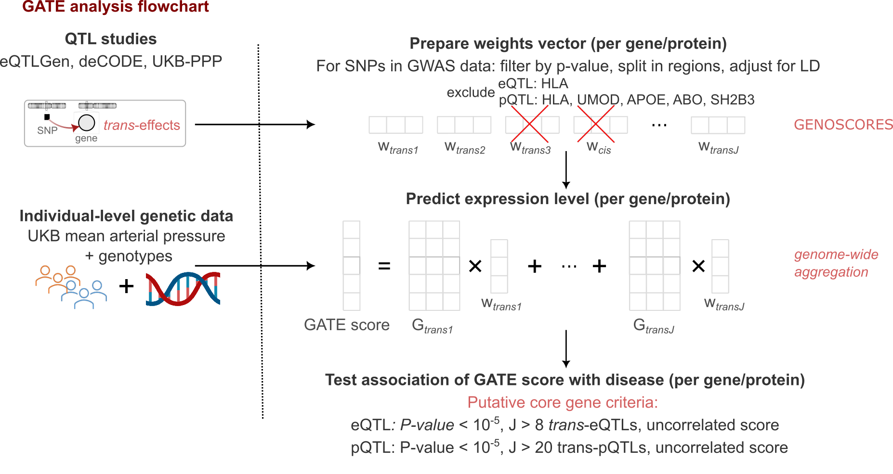

```{r setup, include=FALSE}
knitr::opts_chunk$set(
  echo    = FALSE,
  message = FALSE,
  warning = FALSE,
  cache   = FALSE
)

# Resolve DATA_DIR — works for both local dev and remote clone
source("R/config.R")

# Load shared helpers
source("R/utils.R")

# Existing formatting setup
params <- list()
params$output_format <- "pdf"
if ("kableExtra" %in% loadedNamespaces()) {
  unloadNamespace("kableExtra")
}
library(kableExtra)
options(knitr.kable.NA = ".")
options(knitr.table.format = "latex") # adds tab: prefix to labels
knitr::opts_chunk$set(echo = FALSE, message = FALSE, warning = FALSE, fig.pos = "H")

truncate.pattern <- function(n = 5) {
  paste0(
    "^([^,]+(?:,[^,]+){",
    n - 1,
    "}).*"
  )
}

```

# Abstract

# Introduction

Hypertension affects approximately 1.3 billion individuals worldwide and is one of the leading contributors to global mortality and disability-adjusted life-years [@guzikImmuneInflammatoryMechanisms2024]. It is a major causal risk factor for coronary heart disease, stroke, heart failure, and chronic kidney disease, and therefore contributes disproportionately to the global public health burden [@burnierHypertensionCardiovascularRisk2023]. Current pharmacological treatment relies on several drug classes that primarily target the renin-angiotensin–aldosterone system (RAAS), Ca$^{2+}$ channels, the sympathetic nervous system, metabolic pathways and renal sodium and water handling through diuretics and related agents [@careyTreatmentHypertensionReview2022], although additional physiological systems are also implicated in blood pressure regulation [@beeversPathophysiologyHypertension2001]. Despite these therapeutic options and decades of clinical experience, blood pressure control remains suboptimal: only about 18-23% of individuals with hypertension achieve guideline-recommended targets globally [@ncdriskfactorcollaborationncd-riscWorldwideTrendsHypertension2021]. This persistent treatment gap highlights the need for novel, mechanistically informed targets to prevent and treat hypertension more effectively. 

Human genetics offers a powerful framework for target discovery, because drug targets with robust genetic support from human studies are approximately 2.6-fold more likely to succeed in clinical development than targets lacking such evidence [@minikelRefiningImpactGenetic2024]. For blood pressure traits, large-scale genome-wide association studies (GWAS) have now identified on the order of two thousand common-variant loci [@keatonGenomewideAnalysis12024]. However, these loci collectively explain only a small fraction of the heritability of blood pressure (around 1–3% of the phenotypic variance in individual-level studies), underscoring the highly polygenic architecture of hypertension and providing only limited direct insight into its underlying aetiology [@ehretGeneticVariantsNovel2011]. Most associated variants have small effect sizes, are non-coding, and map to broad genomic regions containing multiple candidate genes, making it challenging to pinpoint the specific genes and pathways that are truly causal and therapeutically tractable. 

Recent advances in statistical genetics and the availability of large-scale genomic and molecular datasets have enabled the development of Genome-wide Aggregated _Trans_ Effects (GATE) analysis, which aggregates genome-wide _trans_-acting genetic effects to prioritise "core genes" with pivotal effects in disease [@iakovlievGenomewideAggregatedTranseffects2023]. The approach has been successfully applied to oligogenic autoimmune disorders, where it has highlighted genes with clear pathogenic relevance and therapeutic potential [@iakovlievGenomewideAggregatedTranseffects2023;@spiliopoulouGenomeWideAggregatedTrans;@zhou_genome-wide_2025;@iakovlievDiscoveryCoreGenes2025;@mckeigueGenomeWideAggregatedTransEffects2025]. Extending GATE to a highly polygenic trait such as hypertension offers an opportunity to translate diffuse GWAS signals into a more interpretable set of biologically central genes and pathways. In this study, we applied GATE analysis to UK Biobank (UKB) data to identify core genes and proteins causally implicated in hypertension.

# Methods
## Data and resource availability

All analysis code is provided in our GitHub repository, and summary statistics for associations between mean arterial pressure and all GATE scores are archived on Zenodo. UK Biobank data are available on application via the UK Biobank access portal. The platform used to generate locus-specific genotypic scores, together with the database of published GWAS summary statistics, is accessible at https://genoscores.cphs.mvm.ed.ac.uk/, and access requests for the GENOSCORES platform and accompanying R package should be directed to the corresponding author.​

## GATE analysis

GATE analysis is a two-stage procedure, as illustrated in Figure \ref{fig:GATE}. In the first stage, we use publicly available regression coefficients (weights) for the association of genome-wide SNP data with gene expression or protein levels (quantitative trait loci or eQTL/pQTL GWAS summary statistics). In the second stage, we apply these weights to individual-level genotypes in the target dataset (UKB) to compute a locus-specific *trans* score for each region and a genome-wide aggregated *trans* (GATE) score for each transcript or protein. These scores then are tested for association with the mean arterial pressure (MAP) in the target dataset. Genes whose GATE scores are significantly associated with the phenotype ($P<10^{-5}$), consist of effects of multiple unlinked *trans* QTLs are prioritized as putative core genes (hereafter referred to as core genes). GATE analysis methods have been reported in earlier works [@iakovlievGenomewideAggregatedTranseffects2023;@spiliopoulouGenomeWideAggregatedTrans;@zhou_genome-wide_2025;@iakovlievDiscoveryCoreGenes2025;@mckeigueGenomeWideAggregatedTransEffects2025].

## Molecular QTL Data

We used publicly available eQTL and pQTL GWAS summary statistics to derive SNP weight vectors for whole-blood transcripts and plasma proteins. These came from large-scale studies: eQTLGen Consortium Phase I (10,317 *trans* eQTLs for 6,298 genes in 31,684 participants [@vosa_large-scale_2021]), deCODE (4,719 proteins on the SomaLogic v4 panel in 35,559 participants [@ferkingstad_large-scale_2021]), and the Olink Explore panel in 54,219 UK Biobank participants (UKB-PPP, 2,923 proteins [@sun_plasma_2023]). Quality control procedures and SNP–protein coefficient estimation have been reported previously [@sun_plasma_2023;@sunGenomicAtlasHuman2018;@ferkingstadLargescaleIntegrationPlasma2021a], and 1,975 SomaLogic aptamers with evidence of cross-reactivity with CFH were excluded from the deCODE data. The eQTL and pQTL datasets were used solely to estimate SNP weights and did not contribute phenotype information. 

## Target Study Populations and Phenotype Definition

The UK Biobank cohort includes approximately 500,000 UK volunteers aged 40–69 years recruited between 2006 and 2010 [@bycroftUKBiobankResource2018]. We used individual-level genotype and phenotype data from UKB as a target cohort, restricted to participants of European ancestry with genome-wide SNP data and valid blood pressure measurements, averaged over two assessments. Ethical approval for UKB was granted by the North West Centre for Research Ethics Committee (11/NW/0382). Written informed consent was obtained from all participants. The present study was conducted under UKB approval (application 23652).

Mean arterial pressure (MAP) was defined as two-thirds diastolic plus one-third systolic blood pressure. Hypertension is a polygenic and common condition, which affects around 30% of adults in the general population, is often diagnosed after a prolonged preclinical period, and is commonly treated with a wide range of antihypertensive and cardiometabolic medications [@british&irishhypertensionsocietyResponseWHOGlobal2025;@shrinerTimetoeventModelingHypertensiona;@gillUseGeneticVariants2019]. To reduce confounding and reverse causation, we restricted the main analysis to participants aged <60 years, in whom genetic effects on blood pressure tend to be stronger and age-related comorbidities and treatment patterns are less likely to confound associations [@vauraPolygenicRiskScores2021]. We also excluded individuals with common risk factors for hypertension, such as chronic kidney disease (estimated glomerular filtration rate <60 mL/min/1.73 m²) or type 1 diabetes [@soodSystematicReviewArticle2024;@botdorfHypertensionCardiovascularKidney2011;@lithoviusAntihypertensiveTreatmentResistant2014]. When testing GATE scores derived from UKB-PPP pQTL summary statistics, individuals included in UKB-PPP were excluded from all association analyses to avoid overlap between the QTL and target datasets. We removed related individuals until no pairs had kinship coefficients $>0.05$, then calculated genotypic principal components from the unrelated set. After all exclusions, we use data from 215,881 individuals, for participants receiving antihypertensive therapy, untreated blood pressure was imputed by adding 15 mmHg and 10 mmHg to systolic and diastolic blood pressure, respectively, following established CHARGE consortium recommendations [@johnsonASSOCIATIONHYPERTENSIONDRUG2011]. 

## Computation of GATE Scores in the Target Dataset

For each genomic region with at least one SNP associated with a transcript or protein at $P<10^{−6}$, we defined a quantitative trait locus by grouping all SNPs associated with that transcript or protein at $P<10{−5}$. A locus was classified as *cis* if its distance from the transcription start site of the encoding gene was $<50$ kb, *cis-x* if 50 kb to 5 Mb, and *trans* if $>5$ Mb. To obtain linkage disequilibrium (LD)-adjusted SNP weights, we premultiplied the univariate regression coefficients by the inverse genotype covariance matrix (add 1000 genomes reference). For each individual, the GATE score for a transcript (eGATE score) or protein (pGATE score) was then calculated as the dot product of the genotypes in the target cohort and these LD-adjusted weights at *trans* QTLs, representing the genetically determined expression or protein level from all *trans* QTLs. The locus-specific contributions are reported in Supplementary Tables \ref{tab:transeqtls}, \ref{tab:transpqtls}. Similarly to previous studies, to avoid confounding by large direct effects on disease, we excluded *trans* eQTLs in the HLA region from GATE scores. To account for the polygenicity of hypertension, for pQTLs we additionally excluded loci such as UMOD, APOE, ABO, and SH2B3, which act as pervasive master regulators of many plasma proteins.

## Association Analysis in UKB and Selection of Core Genes

We tested associations between GATE scores and MAP in unrelated UKB participants of European ancestry, consistent with the European-ancestry restriction of the eQTL and pQTL studies used in the first step. For each score, we fitted a linear regression model with MAP as the continuous outcome and the GATE score as the predictor, adjusted for age, sex, body mass index, body fat percentage, self-reported ethnic background, alcohol consumption, autoimmune thyroid deficiency and 40 genotype principal components. The covariates were chosen based on a regression model seeking association to determine what were the main covariates in the UKB dataset that are associated with blood pressure variation. We adjusted for measures of adiposity because we were explicitly interested in genetic determinants of hypertension beyond those mediated by obesity. We also excluded individuals with autoimmune thyroid disease to reduce potential confounding by autoimmunity [@bertaHypertensionThyroidDisorders2019]. *Cis* score associations with MAP were tested separately.

Putative core transcripts or proteins (collectively termed core genes for simplicity) were selected using two criteria: GATE score association with MAP at $P<10^{−5}$ and effective number of *trans* loci. To reduce the influence of a single pleiotropic variant and maximize signal-to-noise, we required that each GATE score be supported by multiple independent *trans* loci. We quantified this using a diversity index that measures the effective number of loci contributing to the *trans* score and applied thresholds of $\ge5$ (standard GATE) and $\ge8$ or eQTLs or $\ge20$ for pQTLs for the stringent sets in the main text. The formal definition and justification of this index are given in Supplementary Methods. 

## Additional Evidence Supporting Causality for Associated GATE Scores


To further support a causal role for core genes, firstly, we analysed the UKB dataset for *cis* variants (within 5 Mb of the transcription site) associated with MAP or GWAS hits for essential hypertension within 200 kb of the transcription start site are reported in the published meta-GWAS [@cerezoNHGRIEBIGWASCatalog2025]. And secondly, we conducted a Mendelian randomization to test for dose-response relationship between the effect of the *trans* QTLs on the expression of the gene or protein and the effect of those same *trans* QTLs on blood pressure. See Supplementary Material for details.

On the other hand, we further sought external data for additional evidence to support a causal role for core genes. We examined independent evidence including: (1) blood pressure-related or cardiovascular/metabolic disease caused by rare variants in the gene or pathway; (2) blood pressure associations ($n=38,043$) with measured protein levels in UKB-PPP, expected to be stronger than GATE associations if causal; (3) published functional evidence that gene knockout, overexpression, or pharmacological perturbation alters blood pressure in experimental models; and (5) drugs targeting the gene product, ligand, or receptor that affect blood pressure.

# Results

## Association of `r phenoname` with GATE scores for gene expression

Table \ref{tab:coregenes.eqtls.strict} presents the `r coregenes.eqtl.strict[, .N]` GATE scores associated with `r phenoname` at $P<10^{-5}$, where the effective number of _trans_ eQTLs  was at least $8$. 

As shown in the table, there were `r coregenes.eqtl.strict[, .N]` genes that met these filtering criteria, with TREM1 being the most strongly associated. For the majority of these genes there was no evidence of an association of *cis* scores in that gene with MAP, with borderline significant associations for *cis* scores in  *BANK1*, *DPYSL2* and *GPBAR1*. Of the `r coregenes.eqtl.strict[, .N]` putative core genes, coregenes.eqtl.strict[!is.na(reported.genes),.N] have previous GWAS hit for essential hypertension with 200kb, most of which were not localised to any specific gene in the originating GWAS.

Figure \ref{fig:corrplot.eqtls}, displays a heatmap of correlations between GATE scores based on aggregated _trans_ eQTLs ordered by hierarchical clustering. Strong correlations between scores indicate substantial sharing of _trans_ eQTLs contributing to the scores. (Table \ref{tab:transeqtls}). As shown there is a block of highly correlated scores within which there is a subcluster. Annotation of the known functions of these genes shows these genes  are mostly in immune pathways with the subcluster being B-cell related genes. To show sharing of _trans_ eQTLs , we grouped overlapping _trans_ eQTLs into clumps and listed all genes they contribute to as tabulated in Supplementary Table \ref{tab:transeqtls}<!---
 and visualized in Figure xx (INSERT the figure for the sharing of trans eQTLs)-->
.  As highlighted in bold, many clumps harbor known GWAS hits for hypertension  and contribute to many core genes ( i.e. are “ peripheral master regulators” <!--- e.g. INSERT examples -->). 

## Association of `r phenoname` with GATE scores for circulating proteins

The GATE analysis based on circulating protein levels identified `r coregenes.pqtl.strict[, .N]` pGATE scores associated with `r phenoname` at $P<10^{-5}$, following filtering by the effective number of _trans_ pQTLs at least $20$. A more stringent criterion for effective number of _trans_ pQTLs was used to limit the data presentation to a reasonable size. In Table \ref{tab:coregenes.pqtls.strict}), the most strongly associated pGATE scores was for *IL17RB*.   For none of these `r coregenes.pqtl.strict[, .N]` genes was there any evidence of an association of *cis* scores in that gene with MAP. Of the `r coregenes.pqtl.strict[, .N]` putative core genes shown, `r coregenes.pqtl.strict[!is.na(reported.genes),.N]` had a prior GWAS hit within 200kb most of which could not be localised to any gene in the originating GWAS.

As illustrated in Figure \ref{fig:corrplot.pqtls}, the GATE scores were relatively uncorrelated, suggesting that these genes are not linked by a shared biological pathway. This is consistent with the minimal sharing of _trans_ pQTLs observed between these genes (Supplementary Table \ref{tab:transpqtls}).

A full listing of all eGATE and pGATE scores N=`r coregenes.pqtl[, .N]+coregenes.eqtl[, .N]` that were associated with MAP at $P<10^{-5}$ but where the effective number of loci threshold is relaxed to $\ge5$ is shown in Supplementary Tables \ref{tab:coregenes.eqtls} and \ref{tab:coregenes.pqtls}. Of the total of `r coregenes.pqtl[, .N]+coregenes.eqtl[, .N]` genes where eGATE or pGATE scores were associated with MAP at this threshold `r coregenes.eqtl[!is.na(reported.genes),.N]+coregenes.pqtl[!is.na(reported.genes),.N]` harbored a prior GWAS hit within 200kb most of which could not be localised in the originating GWAS. 

## Instrumental variable analysis for supportive evidence of causality (Mendelian randomization analysis)

Supplementary Table \ref{tab:mrhevo} details the results of the MR analysis for putative core genes listed in Table \ref{tab:coregenes.eqtls.strict} and Table \ref{tab:coregenes.pqtls.strict}. We considered that an effective number of loci needs to be at least 20 for MR analysis to have power to demonstrate supportive evidence of causality for any putative core gene. None of the eGATE derived putative core genes had this number of effective loci, and of these only for ABCA1 was there a significant MR result at $P<0.01$. For the `r coregenes.pqtl.strict[, .N]` putative core genes based on pGATE scores in Table \ref{tab:coregenes.pqtls.strict}, by the filtering criterion all had an effective number of loci at least 20. Altogether `r all.evidence.tbl[mr.validated=="+"&source=="pQTL",.N]` of `r coregenes.pqtl.strict[, .N]` genes in Table \ref{tab:coregenes.pqtls.strict} had MR support for causality at $p<0.01$ ( i.e. marginalizing over pleiotropic effects supported a dose-response effect of the protein on MAP at $P < 0.01$).

Figure \ref{fig:mrpqtl} displays the _trans_ pQTL-disease associations plotted against the _trans_ pQTL-transcript associations for the top 6 genes with MR support for causality: _IL17RB_, _CECAM16_, _PTPRF_, _CKB_, _TCL1A_ and _CNTN3_.

## Other Supportive Evidence for the Role of Putative Core Proteins for MAP

In addition, Table \ref{tab:evidence} summarizes for each putative core gene the results of the prespecified criteria other than *trans* QTL effects that support causality of the gene for MAP.  In addition to `r all.evidence.tbl[gwas.validated=="+",.N]` genes having known GWAS hits or *cis* associations, `r all.evidence.tbl[mr.validated=="+",.N]` having significant MR support we note that 
1. Core genes have previously been reported to harbor variants for monogenic forms of disease that could affect blood pressure: *ABCA1*<!--- (Tangier Disease - severe HDL deficiency that may lead to atherosclerosis [@rhyneMultipleSpliceDefects2009])-->,  *ADIPOQ*<!--- (diabetes [@simeoneDominantNegativeADIPOQ2022])-->, *DSG2*<!--- (arrhythmogenic cardiomyopathy[@rouillonSerumProteomicProfiling2015])-->, *ELANE*<!--- (cyclic and congenital neutropenia [@tidwellNeutropeniaassociatedELANEMutations2014])--> and *EDA2R*<!--- (X-linked ectodermal dysplasia [@arringtonRolesEDA2RAgeing2025])-->. 
2. For `r all.evidence.tbl[protein.validated=="+"|protein.validated=="-",.N]` of the core genes, measured levels of the proteins encoded by these genes in the UKB-PPP study showed associations with MAP at $P < 10^{-4}$ in Table \ref{tab:evidence}. The directions of these associations with MAP were consistent with the GATE analysis  for `r all.evidence.tbl[protein.validated=="+",.N]` core genes. See Supplementary Table \ref{tab:proteins.core} for the detailed results.
3. For `r all.evidence.tbl[model.validated=="+",.N]` of the core genes, we identified supportive evidence for a causal relationship based on perturbation in a mouse model of hypertension. Details are summarized in Supplementary Table \ref{tab:explerimental_models}.  For xx genes (TODO:LIST them) the directions of effect of the genetically predicted levels of gene expression (for eGATE scores) or protein levels  (for pGATE scores) on MAP in the GATE analysis are  the same as that expected from animal models. For xx genes, TODO:LIST THESE  their directions of effect in the GATE analysis are the opposite to that expected from animal models.
4. For one gene the proteins encoded by these genes or other proteins in the known pathway these proteins are involved in are in drug development for conditions that affect blood pressure: *TREM1*<!---  (septic shock - hypotension [@francoisProspectiveEvaluationEfficacy2023]) (TODO: REFERENCE supplementary table for further details)-->. 


# Discussion

Applying GATE to mean blood pressure without imposing strong prior hypotheses implicates, alongside established mechanisms involving endothelial function, neural regulation, kidney function and the RAAS, a broad array of immune-related genes. These findings are concordant with accumulating experimental and clinical evidence over recent decades that positions immune dysregulation, encompassing both innate and adaptive immune responses as an important contributor to the development and maintenance of elevated blood pressure [@guzikImmuneInflammatoryMechanisms2024]. Nevertheless, immune pathways remain relatively underexplored as therapeutic targets in hypertension compared with their prominence in other cardiovascular and autoimmune conditions, suggesting that a genetics-led approach may help to uncover tractable immune and non-immune mechanisms for blood pressure control [@murrayTherapeuticTargetingInflammation2021]. 

## Immune mechanisms in hypertension

Hypertension is increasingly recognised as a state of chronic, low-grade inflammation driven by coordinated activation of both the well-established innate immune and the less well-characterised adaptive immune responses [@guzikImmuneInflammatoryMechanisms2024]. The causal contribution of adaptive immunity is supported by animal studies showing that mice lacking mature T and B cells, or specifically $\gamma\delta$ T cells, are protected from blood pressure elevation across several experimental models [@guzikRoleCellGenesis2007;@caillonGdCellsMediate2017]. In humans, higher circulating levels of $\gamma\delta$ T cells and NK cells associate with higher systolic blood pressure, while pro-inflammatory cytokines such as IL6, TNF-$\alpha$, IL1$\beta$, IL18 and CCL2 prospectively predict incident hypertension [@guzikImmuneInflammatoryMechanisms2024;@delaneyNaturalKillerCells2021]. Together with evidence of increased IgG production and vascular IgG deposition in angiotensin II-induced hypertension, and the presence of pro-inflammatory and immunosenescent T cell subsets even in children with primary hypertension, these findings support a model in which T and B cells, autoantibodies, NK cells and myeloid antigen-presenting cells orchestrate vascular and renal inflammation, promoting increased vascular resistance and target-organ damage [@harrisonImmuneMechanismsHypertension2024;@gackowskaLossCD31Receptor2018b].

Genetic and transcriptomic data converge on a similar picture of immune-driven hypertension. Integrative network analysis in the Framingham Heart Study identified SH2B3 as a major driver of blood pressure, with link to T cell activation networks and extensive transcriptional reprogramming in Sh2b3-deficient mice [@huanIntegrativeNetworkAnalysis2015;@salehLymphocyteAdaptorProtein2015]. Gene expression meta-analysis has implicated cytotoxic lymphocyte genes (FGFBP2, PRF1, GNLY, NKG7) and T cell activation genes (IL2, IL2RA, IL2RB, IL15) in blood pressure regulation [@huanMetaanalysisGeneExpression2015]. Complementary GWAS signals at co-stimulatory molecules CD80, CD86 and CD247 further point to co-stimulation and T cell receptor signalling as key pathways [@pinedaPolymorphismsGenesInvolved2020a]. Renal multi-omics studies add end-organ context, revealing dysregulation of interferon signalling, TNF-mediated pathways and proteasomal antigen processing in hypertensive kidneys [@ealesUncoveringGeneticMechanisms2021].

The present GATE analysis prioritises a set of core genes that are enriched for immune functions, including cytokines, inflammasome components and co-stimulatory molecules involved in T cell activation, cytotoxic effector function and antigen presentation. By converging on immune-related core genes from a purely genetic perspective, GATE provides orthogonal support for the central role of immune dysregulation in hypertension and offers a genetically anchored framework for prioritising immune pathways as potential therapeutic targets.

## Genes with convergent evidence of causality

TODO

## Biological interpretation
<!-- this is a useful review https://www.nature.com/articles/s41371-022-00769-8 -->

### Genes that act on or are expressed by endothelial cells

<!-- should test associations of GATE score with each lipid class including metabolomic variables --> 

*  _CD300LG_ is expressed predominantly on vascular endothelial cells.  It has recently been shown to act as a receptor for triglyceride-rich lipoproteins (chylomicrons and VLDL) that facilitates postprandial lipid clearance [@granadeCD300LGReceptorTriglyceriderich2025]. Both the GATE score for CD300LG and measured levels of the protein are inversely associated with blood pressure, and also with plasma triglyceride, coronary disease and type 2 diabetes [show forest plot in supplementary material].  

    - Physical activity increases CDL300LG levels [@lee-odegardSerumProteomicProfiling2024].

* _CD36_ encodes a scavenger receptor that mediates transport of nonesterified fatty acids across the endothelial cell barrier [@son_endothelial_2018] through packaging with ceramides into exosome-like small extracellular vesicles that are released at the basolateral membrane [@peche_endothelial_2023].   

Though the GATE score for _CD36_ is positively associated with blood pressure,  CD36 deficiency in humans is associated with hypertension and with metabolic disturbances including elevated triglyceride levels and resistance to insulin-mediated glucose uptake [@hirano_pathophysiology_2003]

*  _ADIPOQ_ encodes adiponectin, produced by adipocytes and circulates at micromolar concentrations.  Adiponectin enters endothelial cells via CDH13 receptor and forms exosomes containing ceramides - it appears to act as a garbage collector [@tanakaAdiponectinPromotesMuscle2019;@obataAdiponectinTcadherinSystem2018a].  

A possible mechanism by which altered lipid handling in vascular endothelial cells might raise blood pressure is through accumulation of lipid droplets [@jaffe_lipid_2024]. Endothelial lipid droplet accumulation in response to high-fat diet reduces nitric oxide production and raises blood pressure [@kimEndothelialLipidDroplets2023].

<!-- Cultured EC readily form LD largely via the enzyme DGAT (diacylglycerol O-acyltransferase 1) and degrade LD via ATGL (adipocyte triglyceride lipase) after FA loading. -->

* DSG2, expressed on endothelial cells, encodes a receptor for the fatty acid binding protein FABP4 [@chen_desmoglein_2023]. FAB4 levels are associated with blood pressure and the GATE score for FABP4 is associated with blood pressure (probably not in table 2 because below threshold). 


###  Genes in immune / inflammatory pathways

* Inverse association of _IL17RB_ with blood pressure (also with coronary disease). _IL17RB_ is broadly expressed,  it encodes the receptor for IL-17B, and forms a heterodimer with IL-17RA that is the receptor for IL-25 (alias IL-17E).  IL-25 signalling via this pathway induces the expression of _CXCL8_ (alias IL-8).  No experimental studies of effects of IL-17RB perturbation on blood pressure have been reported.  An IL-17RB inhibitor has reached clinical stage for atopic dermatitis [@xuEvaluationSafetyTolerability2024].

* _BTN2A1_ is an immune checkpoint targeting Vγ9Vδ2 T cell cytotoxicity

* _CLEC4C_ receptor for asialo-galactosyl-oligosaccharides. It inhibits interferon production by plasmacytoid dendritic cells

* _CD209_ also known as dendritic cell-specific intercellular adhesion molecule-3–grabbing nonintegrin (DC-SIGN), is a C-type lectin receptor that is expressed primarily on subsets of dendritic cells and certain macrophages. It recognizes and binds to specific carbohydrate moieties—such as high-mannose structures and fucose-containing glycans—on a broad range of pathogens.  

* _CKB_ creatine kinase B plays an unexpected role in modulating TCR-mediated signaling and critically regulates thymocyte selection and T cell activation. 

* _BCL11A_ selective interactions with the NR2E/F subfamily of orphan nuclear receptors, essential for the normal development of B and T cells

* _BANK1_ promotes tyrosine phosphorylation of inositol 1,4,5-trisphosphate receptors, expressed in B cells

* _MEF2C_ expressed by NK cells,  encodes a transcription factor that regulates NK cell function via effects on lipid metabolism

* _TREM1_ encodes a receptor belonging to the Ig superfamily that is expressed on myeloid cells. This protein amplifies neutrophil and monocyte-mediated inflammatory responses 

* _ALOX5AP_ encodes a protein which, with 5-lipoxygenase, is required for leukotriene synthesis

* COBLL1 expression changes during B-cell maturation in non-malignant secondary lymphoid tissue with a higher expression in germinal center B cells than naïve and memory B cells.

* TNFRSF13B encodes TACI, a B cell activating receptor

* IL2RB is one component of the alpha/beta/gamma subunit heterotrimer that is the high-affinity receptor for IL-2. Low-dose IL-2 normalized multi-organ mt function and hypertension in response to placental ischemia. 


### Genes with effects on RAAS or kidney

* _CPA1_ encodes carboxypeptidase 1 which cleaves dietary proteins but also degrades angiotensin II [@pereiraCarboxypeptidasesA1A22012].

* RTN1 encodes reticulon-1, and overexpression in renal cells induces ER stress and apoptosis. Knockdown of Rtn1a expression _in vivo_  attenuates ER stress, proteinuria, glomerular hypertrophy and mesangial expansion in diabetic mice. <!--- possible drug target but intracellular -->

* _KCNJ15_ encodes the inwardly rectifying potassium channel Kir4.2, expressed in multiple tissue, specifically in the collecting ducts of the kidney. 

### Genes with effect on lipids / adiposity

* COBLL1 -- ligand for ROR1 receptor         
Common variant affects metabolically obese normal weight phenotype by reducing ability of subcutaneous adipocytes to store fat.  also expressed in Renal epithelial cells - Ion transport and pH regulation (mainly)


* ABCA1

## Limitations

* Limitations of the analysis platform

  - we have summary stats with > 5 trans-QTLs for only about 500 transcripts and 3500 plasma proteins. This should improve within next year or so. 

  - No coverage of transcripts in tissues other than whole blood.   Plasma proteins appear to cover many proteins that have tissue-specific expression

 - cannot control directly for cell type proportions in whole blood


* Limitations of the method: 

  - we can't easily exclude reverse causation, as we can't establish temporal sequence.  This would require summary stats from younger age groups before hypertension becomes common.  We can do a sensitivity analysis to exclude effects of medication.  

  - Pleiotropy from direct _trans_ QTL effects on disease may confound the inference of core genes, where a gene may appear associated with disease solely because its GATE score contains _trans_ QTLs from regions with large direct effects. 

 
* GATE scores for gene expression explain only approximately 2% of transcript variance, whereas the estimated _trans_ heritability is around 40%. The true effects are substantially larger than those detected. Nevertheless, even weak genetic proxies can tag genes with large effects on disease, as shown previously [@iakovlievGenomewideAggregatedTranseffects2023;@spiliopoulouGenomeWideAggregatedTrans;@zhou_genome-wide_2025;@iakovlievDiscoveryCoreGenes2025;@mckeigueGenomeWideAggregatedTransEffects2025].

# Conclusions

# Acknowledgements

# Funding
SB and AI were supported by MRC Cross-Disciplinary fellowships: add more

# Data availability

add usual statement about ukbb

# Author contributions

fill this out


# Guarantor Data Access and Responsibility Statement

# Duality of Interest

No potential conflicts of interest relevant to this article were reported.


# References{-}
<div id="refs"></div>

\newpage

# Figures{-}

```{r GATE, echo=FALSE, out.width='100%', fig.cap="\\label{fig:GATE} Schematic overview of the GATE analysis. Left (inputs): summary-level eQTL and pQTL GWAS results together with individual-level genotypes and case/control status from the target cohorts. Right (analysis workflow): GATE scores are derived from the eQTL and pQTL summary statistics and individual-level genotypes and then tested for association with mean arterial pressure. For transcripts and proteins whose scores indicate core genes, additional lines of evidence are assessed to support a causal role of the corresponding gene in disease."}



```

```{r corrplot.eqtls, echo=FALSE, out.width='100%', fig.cap="\\label{fig:corrplot.eqtls} Heatmap of pairwise correlations among eGATE scores for putative core transcripts in MAP, arranged by hierarchical clustering. Our reporting criteria for putative core genes were strength of association ($P < 10^{-5}$) with at least eight effective \\textit{trans} eQTLs contributing to the eGATE score. Two distinct clusters emerge: a block of highly correlated scores is evident, containing a subcluster of B-cell-related genes; the broader block comprises genes predominantly involved in immune pathways."}

knitr::include_graphics(file.path(working.dir, "eqtl/eqtl_hits_correlation.png"))

```

```{r corrplot.pqtls, echo=FALSE, out.width='100%', fig.cap="\\label{fig:corrplot.pqtls} Heatmap of pairwise correlations among pGATE scores for putative core proteins in MAP, arranged by hierarchical clustering. Our reporting criteria for putative core genes were strength of association ($P < 10^{-5}$) with at least twenty effective \\textit{trans} pQTLs contributing to the pGATE score. The pGATE scores were largely independent of one another, indicating that the corresponding genes do not converge on a common biological pathway."}

knitr::include_graphics(file.path(working.dir, "pqtl/pqtl_hits_correlation.png"))

```

\newpage

# Tables{-}

```{r coregenes.eqtls.strict, echo=FALSE, warning=FALSE, message=FALSE}

coregenes.eqtl.strict[, gene_startpos := as.integer(gene_startpos)]
coregenes.eqtl.strict[, estimate_cis := as.numeric(estimate_cis)]
coregenes.eqtl.strict[, gene_startpos := as.integer(gene_startpos)]
coregenes.eqtl.strict[, gene_endpos := as.integer(gene_endpos)]
coregenes.eqtl.strict[,
  gene_chrom_fctr := factor(gene_chrom,
                            levels=c(as.character(1:22), "X", "Y"))]

table.data <- coregenes.eqtl.strict[ ,
                   .(gene_symbol, gene_chrom,
                    gene_pos=round(as.integer(gene_startpos) * 1E-6, 2),
                    diversity=round(locus.diversity, 1),
                    logor_trans=ifelse(is.na(gw.variance),
                                paste0("(", round(estimate_trans, 3), ")"),
                                round(estimate_trans * sqrt(gw.variance), 3)),
                    p_trans=pvalue_trans,
                    p_trans_formatted=format.z.aspvalue(z_trans),
                    logor_cis=round(estimate_cis * sqrt(cis.variance), 3),
                    p_cis=pvalue_cis,
                    p_cis_formatted=format.z.aspvalue(z_cis),
                    GWAS.hit=reported.genes)]

## render based on output format parameter
if (params$output_format == "pdf") {
  knitr::kable(table.data[, `:=`(p_cis=NULL, p_trans=NULL)],
             escape=FALSE,
             booktabs=TRUE,
             longtable=TRUE,
             col.names=c("Gene", "Chr", "Start position (Mb)",
                         "Effective number of \\textit{trans} eQTLs",
                         "$\\beta$",
                         "$P$ value",
                         "$\\beta$",
                         "$P$ value",
                         "Reported GWAS hit"),
             caption=("Chr, chromosome; Mb, megabase; $\\beta$, regression coefficient representing the change in MAP (mmHg) per SD increase in the eGATE score. For the analysis 212,569 individuals were included.  Putative core genes were defined by an association $P < 10^{-5}$ and minimum of eight effective \\textit{trans} eQTLs contributing to the eGATE score. Reported GWAS hits for essential hypertension are those falling within 200 kb of the transcription start site; NR indicates that the SNP has not been attributed to a specific gene."),
             label="coregenes.eqtls.strict") %>%
  column_spec(1, italic=TRUE) %>%
  column_spec(2, width = "0.6cm") %>%
  column_spec(3, width = "1cm") %>%
  column_spec(4, width = "1.5cm") %>%
  column_spec(5, width = "1.25cm") %>%
  column_spec(6, width = "1.5cm") %>%
  column_spec(7, width = "1.25cm") %>%
  column_spec(8, width = "1.2cm") %>%
  column_spec(9, width = "1cm", bold=TRUE) %>%
  add_header_above(c(" "=1, "Transcription site"=2,
                     "\\\\textit{trans} score"=3,
                     "\\\\textit{cis} score"=2, " "=1), escape=FALSE) %>%
  kable_styling(latex_options=c("HOLD_position", "repeat_header"))
} else {
  ## Excel/Word output using flextable
  flextable(table.data[, `:=`(p_cis_formatted=NULL, p_trans_formatted=NULL)]) %>%
  theme_vanilla() %>%  # Apply theme immediately after flextable()
  set_header_labels(
    gene_symbol = "Gene",
    gene_chrom = "Chrom",
    gene_pos = "Start position (Mb)",
    diversity = "Effective number of trans eQTLs",
    logor_trans = "Log OR (trans)",
    p_trans = "P-value (trans)",
    logor_cis = "Log OR (cis)",
    p_cis = "P-value (cis)",
    GWAS.hit = "Reported GWAS hit"
  ) %>%
  flextable::italic(j = 1) %>%
  flextable::bold(j = 9) %>%
  fontsize(size = 8) %>%  # Smaller for Word
    width(j = 1, width = 0.7) %>%
    width(j = 2, width = 0.5) %>%
    width(j = 3, width = 0.6) %>%
    width(j = 4, width = 1) %>%
    width(j = 5, width = 0.8) %>%
    width(j = 6, width = 0.8) %>%
    width(j = 7, width = 0.7) %>%
    width(j = 8, width = 0.7) %>%
    width(j = 9, width = 0.7) %>%
    align(align = "center", j = c(2, 3, 4, 5), part = "body") %>%
    align(align = "center", part = "header") %>%
  set_caption(
    caption = "Putative core genes identified through aggregated trans eQTL scores with effective number of trans eQTLs not less than 8."
  )
}

```

\newpage

```{r coregenes.pqtls.strict, echo=FALSE, warning=FALSE, message=FALSE}
options(warn=0)
coregenes.pqtl.strict[, gene_startpos := as.integer(gene_startpos)]
coregenes.pqtl.strict[, estimate_cis := as.numeric(estimate_cis)]
coregenes.pqtl.strict[, gene_startpos := as.integer(gene_startpos)]
coregenes.pqtl.strict[, gene_endpos := as.integer(gene_endpos)]

coregenes.pqtl.strict[,
  gene_chrom_fctr := factor(gene_chrom,
                            levels=c(as.character(1:22), "X", "Y"))]

table.data <- coregenes.pqtl.strict[ ,
                 .(study=car::recode(studyid,
                                     "21='FIN'; 31='IMP'; 26='INT'; 1008='DeC'; 50='UKB'"),
                  gene_symbol, gene_chrom,
                  gene_pos=ifelse(!is.na(gene_startpos),
                                round(as.integer(gene_startpos) * 1E-6, 2), NA),
                  diversity=round(locus.diversity, 1),
                  logor_trans=round(estimate_trans * sqrt(gw.variance), 3),
                  p_trans=pvalue_trans,
                  p_trans_formatted=format.z.aspvalue(z_trans),
                  logor_cis=round(estimate_cis * sqrt(cis.variance), 3),
                  p_cis=pvalue_cis,
                  p_cis_formatted=format.z.aspvalue(z_cis),
                  GWAS.hit=reported.genes)]

## render based on output format parameter
if (params$output_format == "pdf") {
  knitr::kable(
  table.data[, `:=`(p_trans=NULL, p_cis=NULL)],
             escape=FALSE,
             booktabs=TRUE,
             longtable=TRUE,
             col.names=c("pQTL study", "Gene", "Chr", "Start position (Mb)",
                         "Effective number of \\textit{trans} pQTLs",
                          "$\\beta$",
                         "$P$ value",
                         "$\\beta$",
                         "$P$ value",
                         "Reported GWAS hit"),
             caption=("DeC, deCODE study; UKB, UK Biobank Pharma Proteomics Project; Chr, chromosome; Mb, megabase; $\\beta$, regression coefficient representing the change in MAP (mmHg) per SD increase in the pGATE score. For the analysis 212,569 individuals were included from DeC and 190,635 individuals from UKB, with participants enrolled in the proteomics sub-study excluded. Putative core genes were defined by an association $P < 10^{-5}$ and minimum of twenty effective \\textit{trans} pQTLs contributing to the pGATE score. Reported GWAS hits for essential hypertension are those falling within 200 kb of the transcription start site; NR indicates that the SNP has not been attributed to a specific gene. Where multiple pGATE scores exist for a given protein (e.g., derived from different pQTL GWAS), only the score with the strongest association is reported."),
             label="coregenes.pqtls.strict")  %>%
  column_spec(1, width="0.7cm") %>%
  column_spec(2, italic=TRUE) %>%
  column_spec(3, width = "0.6cm") %>%
  column_spec(4, width = "1cm") %>%
  column_spec(5, width = "1.1cm") %>%
  column_spec(6, width = "1.25cm") %>%
  column_spec(7, width = "1.25cm") %>%
  column_spec(8, width = "1.25cm") %>%
  column_spec(9, width = "1.1cm") %>%
  column_spec(10, width = "1cm", bold=TRUE) %>%
  add_header_above(c(" "=2, "Transcription site"=2,
                     "\\\\textit{trans} score"=3,
                     "\\\\textit{cis} score"=2, " "=1), escape=FALSE) %>%
  kable_styling(latex_options=c("HOLD_position", "repeat_header"), font_size=9)
} else {
  ## Excel/Word output using flextable
  flextable(table.data[, `:=`(p_cis_formatted=NULL, p_trans_formatted=NULL)]) %>%
  theme_vanilla() %>%  # Apply theme immediately after flextable()
  set_header_labels(
    study = "pQTL study",
    numobs = "N",
    gene_symbol = "Gene",
    gene_chrom = "Chrom",
    gene_pos = "Start position (Mb)",
    diversity = "Effective number of trans eQTLs",
    logor_trans = "Log OR (trans)",
    p_trans = "P-value (trans)",
    logor_cis = "Log OR (cis)",
    p_cis = "P-value (cis)",
    GWAS.hit = "Reported GWAS hit"
  ) %>%
  flextable::italic(j = 3) %>%
  flextable::bold(j = 11) %>%
  fontsize(size = 8) %>%  # Smaller for Word
    width(j = 1, width = 0.7) %>%
    width(j = 2, width = 0.5) %>%
    width(j = 3, width = 0.7) %>%
    width(j = 4, width = 0.5) %>%
    width(j = 5, width = 0.6) %>%
    width(j = 6, width = 1) %>%
    width(j = 7, width = 0.8) %>%
    width(j = 8, width = 0.8) %>%
    width(j = 9, width = 0.7) %>%
    width(j = 10, width = 0.7) %>%
    width(j = 11, width = 0.7) %>%
  set_caption(
    caption = "Putative core genes identified through aggregated trans pQTL scores with effective number of pQTLs not less than 20."
  )
}

```

\newpage

```{r evidence, echo=FALSE, warning=FALSE, message=FALSE}
eqtl.start <- 1
eqtl.end <- all.evidence.tbl[source=="eQTL", .N] + 2 ## dirty fix, i don't know why the table is shifted 
pqtl.start <- all.evidence.tbl[source=="eQTL", .N+1] + 2
pqtl.end <- all.evidence.tbl[, .N] + 2
xls.tbl <- all.evidence.tbl[, .(gene_symbol, gwas.validated, mr.validated, monogenic.cause, protein.validated,
                                model.validated, drug.validated)]
write_xlsx(xls.tbl, "table2.xlsx")
knitr::kable(xls.tbl,
             escape=FALSE,
             booktabs=TRUE,
             longtable=FALSE,
             col.names=c("Gene symbol", "GWAS hit\\ensuremath{^a}",
                         "Mendelian randomization\\ensuremath{^b}",
                         "Monogenic cause\\ensuremath{^c}",
                         "Measured gene product\\ensuremath{^d}",
                         "Experimental validation\\ensuremath{^e}",                 
                         "Drug effect\\ensuremath{^f}"),
             caption="Additional evidence in support of GATE-detected core genes for MAP with thresholds $P<10^{5}$, effective numbers of eQTL $\\ge 8$ and pQTLs $\\ge 20$. \\newline \\tiny{'+' indicates that the criterion is met; '—' indicates that it is not; '.' data is missing. \\newline (a) Known GWAS hit for essential hypertension exists within 200 kb or if a \\\\textit{cis}-score for the gene is associated with MAP ($P<0.001$). \\newline 
             (b) Mendelian randomization based on \\\\textit{trans}-QTLs and marginalizing over the distribution of pleiotropic effects supports a causal effect for the gene on MAP ($P<0.01$ and effective number of eQTLs/pQTLs $\\ge 20$).  \\newline 
             (c) Rare variants in the gene cause monogenic form of the blood pressure-related disease.  \\newline 
             (d) Correspondence between measured protein levels in UKB-PPP and MAP: '+' indicates association at $P < 10^{-4}$ with effect direction consistent with GATE score effect on MAP; '-' indicates opposite direction; '0' indicates no association.  \\newline 
             (e) There is evidence of causality through perturbation of the gene in an animal model of hypertension or related phenotype.  \\newline          
             (f) Existing investigational drug that targets the protein encoded by the gene or its ligand/receptor has some clinical evidence of efficacy against blood pressure-realated disease.}",
             label="evidence")  %>%
             column_spec(1, width = "2.9cm", italic=TRUE) %>%
             column_spec(2, width = "1.6cm") %>%
             column_spec(3, width = "1.6cm") %>%
             column_spec(4, width = "1.7cm") %>%
             column_spec(5, width = "1.6cm") %>%
             column_spec(6, width = "1.6cm") %>%
             column_spec(7, width = "1.6cm") %>%
             row_spec(eqtl.end, hline_after = TRUE) %>%
             pack_rows("Analysis based on transcripts",
                       start_row=eqtl.start,
                       end_row=eqtl.end) %>%
             pack_rows("Analysis based on circulating proteins",
                       start_row=pqtl.start,
                       end_row=pqtl.end) %>%
             kable_styling(font_size=8,
                          latex_options=c("HOLD_position"))

```

\beginsupplement
\newpage
 
# Supplementary information{-}

## GATE analysis

Genotypes for `r n.variants` SNPs were used in this study. In the training step, *trans* QTLs and their effect sizes were extracted from large-scale genome-wide association studies of whole-blood gene expression and circulating protein levels in more than 30,000 participants:

- eQTLGen Consortium, 10,317 *trans* eQTLs for 6,298 genes in 31,684 participants [@vosa_large-scale_2021]
- deCODE SomaScan study, 4,719 proteins on the SomaLogic v4 panel in 35,559 participants [@ferkingstad_large-scale_2021]
- UK Biobank Pharma Proteomics Project (UKB-PPP), 2,923 proteins on the Olink Explore panel in 54,219 [@sun_plasma_2023]

GATE scores for each gene or protein were computed for each individual by summing LD-adjusted genotypes at each *trans*-QTL locus, weighted by their effect on gene expression or protein levels. SNPs corresponding to *cis* QTLs for the gene were aggregated separately into a *cis* score, independent from the GATE score. *trans* QTLs in the HLA region (25 to 34 Mb on chromosome 6) were excluded from GATE score computation to avoid confounding by strong direct effects of HLA antigens. For the GATE scores derived from pQTLs we also exclude UMOD (chr16:20333051-20356301), APOE (chr19:44-46Mb), ABO (chr9:129068560-136495351) and SH2B3 (chr12:111090-111660kb) as major master regulators.

To quantify the effective number of unlinked *trans* QTLs contributing to each genome-wide *trans*-score, we calculated the Hill diversity index [@hill_diversity_1973]. For each gene, the diversity index was computed from the variances of the $K$ locus-specific *trans* scores as $2^{-\sum_{i=1}^{K} p_i \log_2 p_i}$. Here, $p_i = \sigma^2_i / \sum_{j=1}^{K} \sigma^2_j$ and $\sigma_i$ denotes the variance of the $i$-th locus-specific *trans* score. This index ranges from 1 (when one QTL substantially dominates variance) to $K$ (when locus-specific variances are approximately equal).

Fitted values from this base model were then used to compute score tests for association with the _cis_ score and the aggregated _trans_ score for each transcript and circulating protein. These score tests are based on the gradient and negative second derivative of the log-likelihood at the null. In large samples, score tests, maximized likelihood ratio tests, and Wald tests are asymptotically equivalent, but the score test is substantially faster to compute when many variables are tested one at a time sharing the same base model. Log-odds ratios reported in the tables were standardized by multiplying the corresponding regression coefficients by the standard deviation of the score, so that each coefficient can be interpreted as the log-odds ratio associated with a one-standard deviation increase in the score. 

## Mendelian randomization analysis with multiple weak and pleiotropic genetic instruments

Where _trans_ QTLs were available to derive genetic instruments, we sought to establish a dose-response relationship between the genetic effects on the exposure (gene expression or protein levels) and the outcome (disease). This provides evidence of causality independent of the GATE analysis. This framework constitutes a two-sample Mendelian randomization analysis using _trans_ effects, as described previously [@mckeigue_inference_2023] and applied in recent studies [@zhou_genome-wide_2025; @mckeigueGenomeWideAggregatedTransEffects2025; @iakovlievDiscoveryCoreGenes2025]. While similar to the Bayesian method described by Grant et al. [@grant_bayesian_2024], our approach differs in several key respects. First, our model employs the regularized horseshoe prior [@piironen_sparsity_2017] to regularize the size of non-zero direct effects. Second, the method is implemented in the Stan probabilistic programming language. Finally, we obtain the marginal likelihood by dividing the posterior distribution of the causal effect parameter by the prior. This marginal likelihood is then used to calculate the maximum likelihood estimate and _P_-value.

## Proteomics analysis

GATE scores typically explain only a small proportion of the variance in measured protein levels [@iakovlievDiscoveryCoreGenes2025]. Consequently, if a protein is causal, the association between the disease and measured protein levels is expected to be substantially stronger than the association with the GATE score. We thus tested for associations between `r phenoname` and levels of circulating proteins available from the UK Biobank Pharma Proteomics Project. This resource provides individual-level data for 2,923 circulating proteins assayed on the Olink panel across 53,014 participants. For this analysis, `r phenoname` was ascertained directly within this sub-cohort. We excluded proteins with greater than 20% missingness. For the remaining proteins, missing values were imputed via an Expectation-Maximization algorithm that estimates values based on the covariance structure of the observed data, as implemented in the Python package `ppca`.

## Annotation of genes by rare-variant burden

For genes discovered through _trans_ effects, we sought orthogonal validation by assessing evidence from rare coding variation. It has been previously demonstrated that genes targeted by _trans_ QTLs associated with GWAS loci are enriched for rare variants of large effect [@bakker_identification_2024]. Accordingly, we queried two comprehensive public resources of gene-based rare-variant association statistics: Genebass (app.genebass.org) and the AstraZeneca PheWAS portal (azphewas.com). These platforms report results from SKAT-O and related collapsing or burden tests across a wide range of clinical outcomes in exome-sequenced UK Biobank participants. We systematically examined gene-level associations with clinical phenotypes to determine whether the direction and nature of the rare-variant burden signals were concordant with the effects predicted by the GATE analysis.

## Drug Targets (put into table)
**TREM1** [@francoisProspectiveEvaluationEfficacy2023]
* Drug: Nangibotide (inotrem)
* Disease tested: Septic shock (Phase 2b ASTONISH trial completed, Phase 3 ACCURATE trial actively enrolling)​ [@francoisRationaleProtocolEfficacy2021].
* Blood pressure effect: In septic shock patients, the condition itself presents with vasopressor-dependent hypotension. Nangibotide demonstrated significant improvement in Sequential Organ Failure Assessment (SOFA) scores at day 5 in patients with high baseline sTREM-1 levels (approximately 50% of septic shock patients). While the drug addresses sepsis-related organ dysfunction including cardiovascular collapse, specific quantitative blood pressure effects are not directly reported as the primary focus was multi-organ function improvement [@francoisRationaleProtocolEfficacy2021].​​
* Cardiovascular context: TREM1 is also implicated in cardiovascular disease—elevated sTREM1 predicts mortality in acute myocardial infarction patients, and TREM1 inhibition in animal models improved cardiac function and reduced inflammatory injury [@xueRoleTREMReceptor2025]. 

**IL-17RB** [@davisInterleukin17AKey2021]
   * Drug name: SM17
   * Disease tested: Atopic dermatitis
   * Blood pressure effect: Not reported

- **ABCA1**: CS-6253 (Phase 2, Alzheimer's) - pleiotropic cardiovascular effects possible [@choiBiomedicalAdvancesABCA12023]
- **GPBAR1/TGR5**: INT-777 (Phase 1, T2DM/NAFLD) - metabolic-BP connections [@heTakedaProteinCoupled2025]

\newpage

## Supplementary Figures

<!-- ```{r mrpqtl, echo=FALSE, out.width='100%', fig.cap="\\label{fig:mrpqtl} Mendelian randomisation analysis of the effect of the putative
core proteins on MAP in UKB-PPP."}

knitr::include_graphics("figures/mrpqtl.png")

``` -->

```{r mrpqtl, echo=FALSE, out.width='100%', fig.cap="\\label{fig:mrpqtl} Mendelian randomisation analysis of the effect of the putative core proteins on MAP in UKB-PPP. All trans-pQTLs contributing to the pGATE score of the putative core proteins are used as genetic instrumens. The effects of the genetic instrument on protein level and MAP are shown on the x-axis and y-axis, respectively. The size of each point is inversely proportional to the standard error of the ratio estimator. The slope of the straight line represents the maximum likelihood estimate of the causal effect parameter while the shaded ribbon reflects one standard error above and below this maximum likelihood estimate."}
knitr::include_graphics('figures/mrpqtl.png')

```

<!--All trans-pQTLs contributing to the
pGATE score of the putative core proteins are used as genetic instrumens. The effects of the
genetic instrument on protein level and MAP are shown on the x-axis and y-axis,
respectively. The size of each point is inversely proportional to the standard error of the ratio
estimator. The slope of the straight line represents the maximum likelihood estimate of the
causal effect parameter while the shaded ribbon reflects one standard error above and below
this maximum likelihood estimate. -->

\newpage

## Supplementary Tables

```{r coregenes.eqtls, echo=FALSE, warning=FALSE, message=FALSE}

coregenes.eqtl.rest[, gene_startpos := as.integer(gene_startpos)]
coregenes.eqtl.rest[, estimate_cis := as.numeric(estimate_cis)]
coregenes.eqtl.rest[, gene_startpos := as.integer(gene_startpos)]
coregenes.eqtl.rest[, gene_endpos := as.integer(gene_endpos)]
coregenes.eqtl.rest[,
  gene_chrom_fctr := factor(gene_chrom,
                            levels=c(as.character(1:22), "X", "Y"))]

table.data <- coregenes.eqtl.rest[order(pvalue_trans),
                   .(gene_symbol, gene_chrom,
                    gene_pos=round(as.integer(gene_startpos) * 1E-6, 2),
                    diversity=round(locus.diversity, 1),
                    logor_trans=ifelse(is.na(gw.variance),
                                paste0("(", round(estimate_trans, 3), ")"),
                                round(estimate_trans * sqrt(gw.variance), 3)),
                    p_trans=pvalue_trans,
                    p_trans_formatted=format.z.aspvalue(z_trans),
                    logor_cis=round(estimate_cis * sqrt(cis.variance), 3),
                    p_cis=pvalue_cis,
                    p_cis_formatted=format.z.aspvalue(z_cis),
                    GWAS.hit=reported.genes)]

## render based on output format parameter
if (params$output_format == "pdf") {
  knitr::kable(table.data[, `:=`(p_cis=NULL, p_trans=NULL)],
             escape=FALSE,
             booktabs=TRUE,
             longtable=TRUE,
             col.names=c("Gene", "Chr", "Start position (Mb)",
                         "Effective number of \\textit{trans} eQTLs",
                         "$\\beta$",
                         "$P$ value",
                         "$\\beta$",
                         "$P$ value",
                         "Reported GWAS hit"),
             caption=("Chr, chromosome; Mb, megabase; $\\beta$, regression coefficient representing the change in MAP (mmHg) per SD increase in the eGATE score. For the analysis 212,569 individuals were included.  Putative core genes were defined by an association $P < 10^{-5}$ and effective \\textit{trans} eQTLs contributing to the eGATE score not less than five but less than eight. Reported GWAS hits for essential hypertension are those falling within 200 kb of the transcription start site; NR indicates that the SNP has not been attributed to a specific gene."),
             label="coregenes.eqtls") %>%
  column_spec(1, italic=TRUE) %>%
  column_spec(2, width = "0.6cm") %>%
  column_spec(3, width = "1cm") %>%
  column_spec(4, width = "1.5cm") %>%
  column_spec(5, width = "1.25cm") %>%
  column_spec(6, width = "1.5cm") %>%
  column_spec(7, width = "1.25cm") %>%
  column_spec(8, width = "1.2cm") %>%
  column_spec(9, width = "1cm", bold=TRUE) %>%
  add_header_above(c(" "=1, "Transcription site"=2,
                     "\\\\textit{trans} score"=3,
                     "\\\\textit{cis} score"=2, " "=1), escape=FALSE) %>%
  kable_styling(latex_options=c("HOLD_position", "repeat_header"))
} else {
  ## Excel/Word output using flextable
  flextable(table.data[, `:=`(p_cis_formatted=NULL, p_trans_formatted=NULL)]) %>%
  theme_vanilla() %>%  # Apply theme immediately after flextable()
  set_header_labels(
    gene_symbol = "Gene",
    gene_chrom = "Chrom",
    gene_pos = "Start position (Mb)",
    diversity = "Effective number of trans eQTLs",
    logor_trans = "Log OR (trans)",
    p_trans = "P-value (trans)",
    logor_cis = "Log OR (cis)",
    p_cis = "P-value (cis)",
    GWAS.hit = "Reported GWAS hit"
  ) %>%
  flextable::italic(j = 1) %>%
  flextable::bold(j = 9) %>%
  fontsize(size = 8) %>%  # Smaller for Word
    width(j = 1, width = 0.7) %>%
    width(j = 2, width = 0.5) %>%
    width(j = 3, width = 0.6) %>%
    width(j = 4, width = 1) %>%
    width(j = 5, width = 0.8) %>%
    width(j = 6, width = 0.8) %>%
    width(j = 7, width = 0.7) %>%
    width(j = 8, width = 0.7) %>%
    width(j = 9, width = 0.7) %>%
    align(align = "center", j = c(2, 3, 4, 5), part = "body") %>%
    align(align = "center", part = "header") %>%
  set_caption(
    caption = "Putative core genes identified through aggregated trans eQTL scores."
  )
}

```

\newpage

```{r coregenes.pqtls, echo=FALSE, warning=FALSE, message=FALSE}
options(warn=0)
coregenes.pqtl.rest[, gene_startpos := as.integer(gene_startpos)]
coregenes.pqtl.rest[, estimate_cis := as.numeric(estimate_cis)]
coregenes.pqtl.rest[, gene_startpos := as.integer(gene_startpos)]
coregenes.pqtl.rest[, gene_endpos := as.integer(gene_endpos)]

coregenes.pqtl.rest[,
  gene_chrom_fctr := factor(gene_chrom,
                            levels=c(as.character(1:22), "X", "Y"))]

table.data <- coregenes.pqtl.rest[order(pvalue_trans),
                 .(study=car::recode(studyid,
                                     "21='FIN'; 31='IMP'; 26='INT'; 1008='DeC'; 50='UKB'"),
                  gene_symbol, gene_chrom,
                  gene_pos=ifelse(!is.na(gene_startpos),
                                round(as.integer(gene_startpos) * 1E-6, 2), NA),
                  diversity=round(locus.diversity, 1),
                  logor_trans=round(estimate_trans * sqrt(gw.variance), 3),
                  p_trans=pvalue_trans,
                  p_trans_formatted=format.z.aspvalue(z_trans),
                  logor_cis=round(estimate_cis * sqrt(cis.variance), 3),
                  p_cis=pvalue_cis,
                  p_cis_formatted=format.z.aspvalue(z_cis),
                  GWAS.hit=reported.genes)]

## render based on output format parameter
if (params$output_format == "pdf") {
  knitr::kable(
  table.data[, `:=`(p_trans=NULL, p_cis=NULL)],
             escape=FALSE,
             booktabs=TRUE,
             longtable=TRUE,
             col.names=c("pQTL study", "Gene", "Chr", "Start position (Mb)",
                         "Effective number of \\textit{trans} pQTLs",
                         "$\\beta$",
                         "$P$ value",
                         "$\\beta$",
                         "$P$ value",
                         "Reported GWAS hit"),
             caption=("DeC, deCODE study; UKB, UK Biobank Pharma Proteomics Project; Chr, chromosome; Mb, megabase; $\\beta$, regression coefficient representing the change in MAP (mmHg) per SD increase in the pGATE score. For the analysis 212,569 individuals were included from DeC and 190,635 individuals from UKB, with participants enrolled in the proteomics sub-study excluded. Putative core genes were defined by an association $P < 10^{-5}$ and effective \\textit{trans} pQTLs contributing to the pGATE score not less than five but less than twenty. Reported GWAS hits for essential hypertension are those falling within 200 kb of the transcription start site; NR indicates that the SNP has not been attributed to a specific gene. Where multiple pGATE scores exist for a given protein (e.g., derived from different pQTL GWAS), only the score with the strongest association is reported."),
             label="coregenes.pqtls")  %>%
  column_spec(1, width="0.7cm") %>%
  column_spec(2, italic=TRUE) %>%
  column_spec(3, width = "0.6cm") %>%
  column_spec(4, width = "1cm") %>%
  column_spec(5, width = "1.1cm") %>%
  column_spec(6, width = "1.25cm") %>%
  column_spec(7, width = "1.25cm") %>%
  column_spec(8, width = "1.25cm") %>%
  column_spec(9, width = "1.1cm") %>%
  column_spec(10, width = "1cm", bold=TRUE) %>%
  add_header_above(c(" "=2, "Transcription site"=2,
                     "\\\\textit{trans} score"=3,
                     "\\\\textit{cis} score"=2, " "=1), escape=FALSE) %>%
  kable_styling(latex_options=c("HOLD_position", "repeat_header"), font_size=9)
} else {
  ## Excel/Word output using flextable
  flextable(table.data[, `:=`(p_cis_formatted=NULL, p_trans_formatted=NULL)]) %>%
  theme_vanilla() %>%  # Apply theme immediately after flextable()
  set_header_labels(
    study = "pQTL study",
    numobs = "N",
    gene_symbol = "Gene",
    gene_chrom = "Chrom",
    gene_pos = "Start position (Mb)",
    diversity = "Effective number of trans eQTLs",
    logor_trans = "Log OR (trans)",
    p_trans = "P-value (trans)",
    logor_cis = "Log OR (cis)",
    p_cis = "P-value (cis)",
    GWAS.hit = "Reported GWAS hit"
  ) %>%
  flextable::italic(j = 3) %>%
  flextable::bold(j = 11) %>%
  fontsize(size = 8) %>%  # Smaller for Word
    width(j = 1, width = 0.7) %>%
    width(j = 2, width = 0.5) %>%
    width(j = 3, width = 0.7) %>%
    width(j = 4, width = 0.5) %>%
    width(j = 5, width = 0.6) %>%
    width(j = 6, width = 1) %>%
    width(j = 7, width = 0.8) %>%
    width(j = 8, width = 0.8) %>%
    width(j = 9, width = 0.7) %>%
    width(j = 10, width = 0.7) %>%
    width(j = 11, width = 0.7) %>%
  set_caption(
    caption = "Putative core genes identified through aggregated trans pQTL scores."
  )
}

```

\newpage

```{r mrhevo, echo=FALSE, warning=FALSE, message=FALSE}

all.mrres <- unique(all.mrres, by = "exposure") ## Dirty fix
all.mrres.eQTL <- all.mrres[study=="eQTLGen"]
setorder(all.mrres.eQTL, pvalue)
all.mrres.pQTL <- all.mrres[study!="eQTLGen"]
setorder(all.mrres.pQTL, pvalue)
all.mrres.ordered <- rbind(all.mrres.eQTL, all.mrres.pQTL)
eqtl.start <- 1
eqtl.end <- all.mrres.ordered[study=="eQTLGen", .N] ## dirty fix, i don't know why the table is shifted 
pqtl.start <- all.mrres.ordered[study=="eQTLGen", .N+1]
pqtl.end <- all.mrres.ordered[, .N]
mr.table <- all.mrres.ordered[,
                      .(gene = exposure,
                        study,
                        J,
                        Estimate = round(Estimate, 3),
                        pvalue,
                        pvalue.formatted = format.z.aspvalue(z))]

if (params$output_format == "pdf") {
  kable(mr.table[, pvalue := NULL],
      escape=FALSE,
      booktabs=TRUE,
      longtable=TRUE,
      col.names=c("Gene", "QTL study", "Number of \\textit{trans} QTLs",
                  "Estimate of causal effect parameter", "$P$ value"),
      label="mrhevo",
      caption="Mendelian randomization analysis of effects of putative core genes in Table \\ref{tab:coregenes.eqtls.strict} and Table \\ref{tab:coregenes.pqtls.strict} on disease. The likelihood of the causal effect parameter is computed by marginalizing over the posterior distribution of the direct (pleiotropic) effects of the genetic instruments on the disease. Putative core genes were defined by an association $P < 10^{-5}$ and minimum of eight (twenty) effective \\textit{trans} eQTLs (pQTLs) contributing to the GATE score. Genetic study of gene expression or protein levels in which instruments were created is shown in QTL study column.") %>%
      # footnote(general_title="",
      #          threeparttable=FALSE,
      #          footnote_as_chunk = FALSE,
      #          general=c("The likelihood of the causal effect parameter is computed by marginalizing over the posterior distribution of the direct (pleiotropic) effects of the genetic instruments on the disease.",
      #          "Genetic study of gene expression or protein levels in which instruments were created is shown in QTL study column.",
      #          "Number of \\\\textit{trans} QTLs shows how many instruments were used in the analysis based on unlinked \\\\textit{trans} QTLs for each gene."),
      #          escape=FALSE) %>%
    column_spec(1, italic=TRUE, width="2.5cm") %>%
    column_spec(2, width = "2cm") %>%
    column_spec(3, width="2cm") %>%
    column_spec(4, width = "2cm") %>%
    column_spec(5, width = "1.5cm") %>%
    column_spec(6, width = "2.5cm") %>%
    row_spec(eqtl.end, hline_after = TRUE) %>%
    pack_rows("Analysis based on transcripts",
              start_row=eqtl.start,
              end_row=eqtl.end) %>%
    pack_rows("Analysis based on circulating proteins",
              start_row=pqtl.start,
              end_row=pqtl.end) %>%
    kable_styling(latex_options=c("HOLD_position", "repeat_header"))
} else {
  # Word/Excel rendering using flextable
  flextable(mr.table[, pvalue.formatted := NULL]) %>%
    set_header_labels(
      gene = "Gene",
      study = "QTL study",
      J = "Number of trans QTLs",
      Estimate = "Estimate of causal effect",
      pvalue = "P-value"
    ) %>%
    flextable::italic(j = 1) %>%  # Italicize gene names
    fontsize(size = 9) %>%
    width(j = 1, width = 1.2) %>%  # Gene
    width(j = 2, width = 1.3) %>%  # QTL study
    width(j = 3, width = 1.0) %>%  # Number of trans QTLs
    width(j = 4, width = 1.1) %>%  # Estimate
    width(j = 5, width = 0.8) %>%  # P-value
    align(align = "center", j = c(3, 4, 5), part = "body") %>%
    align(align = "center", part = "header") %>%
    theme_vanilla() %>%
    set_caption(
      caption = "Mendelian randomization analysis of effects of putative core genes on disease."
    ) %>%
    add_footer_lines(
      "The likelihood of the causal effect parameter is computed by marginalizing over the posterior distribution of the direct (pleiotropic) effects of the genetic instruments on the disease. Genetic study of gene expression or protein levels in which instruments were created is shown in QTL study column. Number of trans QTLs shows how many instruments were used in the analysis based on unlinked trans QTLs for each gene."
    ) %>%
    set_table_properties(width = 1, layout = "autofit")
}

```

\newpage

```{r proteins.core, echo=FALSE, warning=FALSE, message=FALSE}
options(warn=0)

  # if (binary) {
  #   setnames(coeffs.protein.core,
  #        c("Gene", "noncases", "cases", "coeff", "pvalue.formatted"),
  #        c("Gene", "Non.cases", "Cases", "Log OR", "P-value"))
  # }

coeffs.protein.core.joined.eQTL <- coeffs.protein.core.joined[study=="eQTLGen"]
setorder(coeffs.protein.core.joined.eQTL, pvalue_trans)
coeffs.protein.core.joined.pQTL <- coeffs.protein.core.joined[study!="eQTLGen"]
setorder(coeffs.protein.core.joined.pQTL, pvalue_trans)
coeffs.protein.core.joined.ordered <- rbind(coeffs.protein.core.joined.eQTL, coeffs.protein.core.joined.pQTL)
eqtl.start <- 1
eqtl.end <- coeffs.protein.core.joined.ordered[study=="eQTLGen", .N]
pqtl.start <- coeffs.protein.core.joined.ordered[study=="eQTLGen", .N+1]
pqtl.end <- coeffs.protein.core.joined.ordered[, .N]

table.data <- coeffs.protein.core.joined.ordered[,
                   .(Gene, study, coeff, pvalue.formatted,
                   logor_trans=ifelse(is.na(gw.variance),
                                paste0("(", round(estimate_trans, 3), ")"),
                                round(estimate_trans * sqrt(gw.variance), 3)), 
                    p_trans_formatted=format.z.aspvalue(z_trans))]

if (params$output_format == "pdf") {
    knitr::kable(table.data,
              longtable=TRUE,
              escape=FALSE,
              booktabs=TRUE,
              col.names=c("Gene",
                        "QTL study",            
                         "$\\beta$",
                         "$P$ value",
                         "$\\beta$",
                         "$P$ value"),
              caption=("Association of MAP with the measured protein level for putative core genes was tested in the UKB-PPP study. Putative core genes were defined by an association $P < 10^{-5}$ and minimum of eight (twenty) effective \\textit{trans} eQTLs (pQTLs) contributing to the GATE score."),
        label="proteins.core")  %>%
      column_spec(1, italic=TRUE) %>%
      column_spec(2, width="2.5cm") %>%  # QTL study
      column_spec(3, width="2.5cm") %>%
      column_spec(4, width = "2.5cm") %>%
      column_spec(5, width = "2.5cm") %>%
      column_spec(6, width = "2.5cm") %>%
        add_header_above(c(" "=2,
                     "protein association"=2,
                     "\\\\textit{trans} score"=2), escape=FALSE) %>%
      row_spec(eqtl.end, hline_after = TRUE) %>%
      pack_rows("Analysis based on transcripts",
              start_row=eqtl.start,
              end_row=eqtl.end) %>%
      pack_rows("Analysis based on circulating proteins",
              start_row=pqtl.start,
              end_row=pqtl.end) %>%
      kable_styling(latex_options=c("HOLD_position", "repeat_header"), font_size=9)

} else {
  ## Word/Excel rendering using flextable with numeric p-values
  ## create a copy for Word output with numeric p-values
  coeffs.protein.word <- copy(coeffs.protein.core)

  ## extract numeric p-values from the LaTeX formatted strings
  coeffs.protein.word[, `P-value` := {
    ## extract the content between \ensuremath{ and }
    content <- gsub(".*\\\\ensuremath\\{(.*)\\}.*", "\\1", `P-value`)
    ## replace \times with * and handle the exponent format
    content <- gsub("\\\\times", "*", content)
    ## replace ^{...} with e notation
    content <- gsub("\\^\\{(-?[0-9]+)\\}", "\\^\\1", content)
  }]

  flextable(coeffs.protein.word) %>%
    theme_vanilla() %>%
    set_header_labels(
      Gene = "Gene",
      Non.cases = "Non-cases",
      Cases = "Cases",
      `Log OR` = "Log OR",
      `P-value` = "P-value"
    ) %>%
    flextable::italic(j = 1) %>%
    fontsize(size = 9) %>%
    width(j = 1, width = 1.2) %>%  # Gene
    width(j = 2, width = 1.1) %>%  # Non-cases
    width(j = 3, width = 1.0) %>%  # Cases
    width(j = 4, width = 1.0) %>%  # LogOR
    width(j = 5, width = 0.9) %>%  # P-value
    align(align = "center", j = c(2, 3, 4, 5), part = "body") %>%
    align(align = "center", part = "header") %>%
    set_caption(
      caption = "Tests of association with plasma levels of proteins measured in the UK Biobank cohort and encoded by genes."
    )
}

```

\newpage

```{r transeqtls, echo=FALSE, warning=FALSE, message=FALSE}

knitr::kable(clumpseqtl.print,
             escape=FALSE,
             booktabs=TRUE,
             longtable=TRUE,
             col.names=c("\\textit{Trans} pQTL clump", "Chrom",
                         "Clump start position (Mb)",
                         "Clump end position (Mb)",
                         "Target genes",
                         "Genes in or near \\textit{trans} pQTL clump"),
             caption="\\textit{Trans} eQTLs for genes identified in Table \\ref{tab:coregenes.eqtls}",
             label="transeqtls")  %>%
  footnote(general_title="",
           threeparttable=TRUE,
           footnote_as_chunk = TRUE,
           general=paste("In the clumps of \\textit{trans} eQTLs, genes previously reported as GWAS hits are shown in bold, together with up to 5 genes not reported as GWAS hits."),
           escape=FALSE) %>%
  column_spec(1, width = "1cm") %>%
  column_spec(2, width = "1cm") %>%
  column_spec(3, width = "1.5cm") %>%
  column_spec(4, width = "1.5cm") %>%
  column_spec(5, width = "3.5cm", italic=TRUE) %>%
  column_spec(6, width = "3cm", italic=TRUE) %>%
    kable_styling(latex_options=c("HOLD_position")) # , "scale_down"))

```

\newpage

```{r transpqtls, echo=FALSE, warning=FALSE, message=FALSE}

knitr::kable(clumpspqtl.print,
             escape=FALSE,
             booktabs=TRUE,
             longtable=TRUE,
             col.names=c("\\textit{Trans} pQTL clump", "Chrom",
                         "Clump start position (Mb)",
                         "Clump end position (Mb)",
                         "Target genes",
                         "Genes in or near \\textit{trans} pQTL clump"),
             caption="\\textit{Trans} pQTLs for genes identified as putative core genes",
             label="transpqtls")  %>%
  footnote(general_title="",
           threeparttable=TRUE,
           footnote_as_chunk = TRUE,
           general=paste("In the clumps of \\textit{trans} pQTLs, genes previously reported as GWAS hits are shown in bold, together with up to 5 genes not reported as GWAS hits."),
           escape=FALSE) %>%
  column_spec(1, width = "1cm") %>%
  column_spec(2, width = "1cm") %>%
  column_spec(3, width = "1.5cm") %>%
  column_spec(4, width = "1.5cm") %>%
  column_spec(5, width = "3.5cm", italic=TRUE) %>%
  column_spec(6, width = "3cm", italic=TRUE) %>%
  kable_styling(latex_options=c("HOLD_position"))

```
