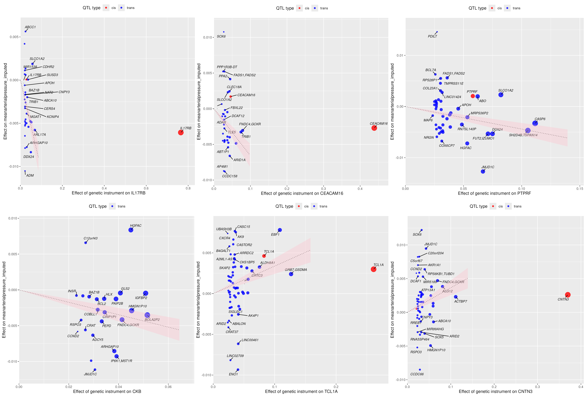

```{r setup, include=FALSE}
knitr::opts_chunk$set(
  echo    = FALSE,
  message = FALSE,
  warning = FALSE,
  cache   = FALSE
)

## min_gwas_clumps values used in Figs 2 and 4 (referenced in figure legend text and captions)
.min_gwas_eqtl <- 2L
.min_gwas_pqtl <- 10L

# Resolve DATA_DIR — works for both local dev and remote clone
source("R/config.R")

# Load shared helpers
source("R/utils.R")

# Existing formatting setup
params <- list()
params$output_format <- "pdf"
if ("kableExtra" %in% loadedNamespaces()) {
  unloadNamespace("kableExtra")
}
library(kableExtra)
options(knitr.kable.NA = ".")
options(knitr.table.format = "latex") # adds tab: prefix to labels
knitr::opts_chunk$set(echo = FALSE, message = FALSE, warning = FALSE, fig.pos = "H")

truncate.pattern <- function(n = 5) {
  paste0(
    "^([^,]+(?:,[^,]+){",
    n - 1,
    "}).*"
  )
}

## Approximate word count (Title Page, Abstract, Text, References, Tables, Figure Legends)
local({
  lns <- readLines("hypertension_paper.Rmd", warn = FALSE)
  # Remove YAML header
  yml_end <- which(lns == "---")[2L]
  if (!is.na(yml_end)) lns <- lns[(yml_end + 1L):length(lns)]
  # Remove R code chunks
  in_chunk <- FALSE
  keep <- rep(TRUE, length(lns))
  for (i in seq_along(lns)) {
    if (grepl("^```\\{", lns[i]))  { in_chunk <- TRUE;  keep[i] <- FALSE; next }
    if (in_chunk && lns[i] == "```") { keep[i] <- FALSE; in_chunk <- FALSE; next }
    if (in_chunk) keep[i] <- FALSE
  }
  lns <- lns[keep]
  # Remove Non-standard Abbreviations section from word count
  abbrev_idx <- grep("^# Non-standard [Aa]bbreviations", lns)
  if (length(abbrev_idx)) {
    next_sec_idx <- which(grepl("^# ", lns) & seq_along(lns) > abbrev_idx[1L])
    end_idx <- if (length(next_sec_idx)) next_sec_idx[1L] - 1L else length(lns)
    lns <- lns[-seq(abbrev_idx[1L], end_idx)]
  }
  # Remove HTML comments, inline R, LaTeX math, markdown images
  lns <- gsub("<!--[\\s\\S]*?-->", " ", paste(lns, collapse = "\n"), perl = TRUE)
  lns <- strsplit(lns, "\n")[[1L]]
  lns <- gsub("`r [^`]+`",        " ", lns)
  lns <- gsub("\\$\\$?[^$]+\\$\\$?", " ", lns)
  lns <- gsub("!\\[.*?\\]\\(.*?\\)", " ", lns)
  lns <- gsub("\\\\[a-zA-Z]+\\{[^}]*\\}", " ", lns)
  # Count
  .wordcount <<- sum(sapply(strsplit(lns[nzchar(trimws(lns))], "\\s+"), length))
})

```

* Short title: Genome-wide aggregated _trans_-effects in hypertension

* Date: `r format(Sys.Date(), "%d %B %Y")`

* Word count (Title Page, Abstract, Text, References, Tables, Figure Legends): `r .wordcount`

\newpage

# Abstract

# Graphical Abstract{-}

```{=latex}
\begin{center}
\includegraphics[width=\textwidth]{figures/gate.analysis.flowchart.supporting.evidence.png}
\end{center}
```

# Non-standard abbreviations and acronyms

CHARGE, Cohorts for Heart and Aging Research in Genomic Epidemiology;
eGATE, eQTL-based Genome-wide Aggregated *Trans*-Effects score;
eQTL, expression quantitative trait locus (loci);
GATE, Genome-wide Aggregated *Trans* Effects;
GWAS, genome-wide association study (studies);
HDL, high-density lipoprotein;
HLA, human leukocyte antigen;
IgG, immunoglobulin G;
LD, linkage disequilibrium;
MAP, mean arterial pressure;
MR, Mendelian randomization;
NK, natural killer (cells);
pGATE, pQTL-based Genome-wide Aggregated *Trans*-Effects score;
pQTL, protein quantitative trait locus (loci);
RAAS, renin-angiotensin-aldosterone system;
SKAT-O, Sequence Kernel Association Test–Optimised;
SNP, single nucleotide polymorphism;
UKB, UK Biobank;
UKB-PPP, UK Biobank Pharma Proteomics Project;
VLDL, very low-density lipoprotein

# Introduction
For blood pressure traits, large-scale genome-wide association studies (GWAS) have now identified on the order of two thousand common-variant loci [@keatonGenomewideAnalysis12024]. However, these loci collectively explain only a small fraction of the heritability of blood pressure (around 1–3% of the phenotypic variance in individual-level studies), underscoring the highly polygenic architecture of hypertension and providing only limited direct insight into its underlying aetiology [@ehretGeneticVariantsNovel2011]. Most associated variants have small effect sizes, are non-coding, and map to broad genomic regions containing multiple candidate genes, making it challenging to pinpoint the specific genes and pathways that are truly causal and therapeutically tractable. 

Recent advances in statistical genetics and the availability of large-scale genomic and molecular datasets have enabled the development of Genome-wide Aggregated _Trans_ Effects (GATE) analysis, which aggregates genome-wide _trans_-acting genetic effects to prioritise "core genes" with pivotal effects in disease [@iakovlievGenomewideAggregatedTranseffects2023]. The approach has been successfully applied to oligogenic autoimmune disorders, where it has highlighted genes with clear pathogenic relevance and therapeutic potential [@iakovlievGenomewideAggregatedTranseffects2023;@spiliopoulouGenomeWideAggregatedTrans;@zhou_genome-wide_2025;@iakovlievDiscoveryCoreGenes2025;@mckeigueGenomeWideAggregatedTransEffects2025]. Extending GATE to a highly polygenic trait such as hypertension offers an opportunity to translate diffuse GWAS signals into a more interpretable set of biologically central genes and pathways. In this study, we applied GATE analysis to UK Biobank (UKB) data to identify core genes and proteins causally implicated in hypertension. One specific objective was to investigate the role of inflammation driven by the innate and adaptive immune systems [@guzikImmuneInflammatoryMechanisms2024]. 

# Methods
## Data and resource availability
UK Biobank data are available on application via the UK Biobank access portal.  Analysis code that generates this manuscript from summary-level data is provided in our GitHub repository.  Summary-level,data is available on Zenodo.  and summary statistics for associations between mean arterial pressure and all GATE scores are archived on Zenodo.

## Study populations and phenotype definition
The UK Biobank cohort includes approximately 500,000 UK volunteers aged 40–69 years recruited between 2006 and 2010 [@bycroftUKBiobankResource2018]. We used individual-level genotype and phenotype data from UKB as a target cohort, restricted to participants of European ancestry with genome-wide SNP data and valid blood pressure measurements, averaged over two assessments. Ethical approval for UKB was granted by the North West Centre for Research Ethics Committee (11/NW/0382). Written informed consent was obtained from all participants. The present study was conducted under UKB approval (application 23652).

Mean arterial pressure (MAP) was defined as two-thirds diastolic plus one-third systolic blood pressure. Hypertension is a polygenic and common condition, which affects around 30% of adults in the general population, is often diagnosed after a prolonged preclinical period, and is commonly treated with a wide range of antihypertensive and cardiometabolic medications [@british&irishhypertensionsocietyResponseWHOGlobal2025;@shrinerTimetoeventModelingHypertensiona;@gillUseGeneticVariants2019]. To reduce confounding and reverse causation, we restricted the main analysis to participants aged <60 years, in whom genetic effects on blood pressure tend to be stronger and age-related comorbidities and treatment patterns are less likely to confound associations [@vauraPolygenicRiskScores2021]. We also excluded individuals with common risk factors for hypertension, such as chronic kidney disease (estimated glomerular filtration rate <60 mL/min/1.73 m²) or type 1 diabetes [@soodSystematicReviewArticle2024;@botdorfHypertensionCardiovascularKidney2011;@lithoviusAntihypertensiveTreatmentResistant2014]. When testing GATE scores derived from UKB-PPP pQTL summary statistics, individuals included in UKB-PPP were excluded from all association analyses to avoid overlap between the QTL and target datasets. We removed related individuals until no pairs had kinship coefficients $>0.05$, then calculated genotypic principal components from the unrelated set. After all exclusions, we use data from 215,881 individuals, for participants receiving antihypertensive therapy, untreated blood pressure was imputed by adding 15 mmHg and 10 mmHg to systolic and diastolic blood pressure, respectively, following established CHARGE consortium recommendations [@johnsonASSOCIATIONHYPERTENSIONDRUG2011]. 

## Computation of GATE scores
GATE analysis is a two-stage procedure, as illustrated in the Graphical Abstract. In the first stage, we use publicly available regression coefficients (weights) for the association of genome-wide SNP data with gene expression or protein levels (quantitative trait loci or eQTL/pQTL GWAS summary statistics). In the second stage, we apply these weights to individual-level genotypes in the target dataset (UKB) to compute a locus-specific *trans* score for each region and a genome-wide aggregated *trans* (GATE) score for each transcript or protein. These scores then are tested for association with the mean arterial pressure (MAP) in the target dataset. Genes whose GATE scores are significantly associated with the phenotype ($P<10^{-5}$), consist of effects of multiple unlinked *trans* QTLs are prioritized as putative core genes (hereafter referred to as core genes). GATE analysis methods have been reported in earlier works [@iakovlievGenomewideAggregatedTranseffects2023;@spiliopoulouGenomeWideAggregatedTrans;@zhou_genome-wide_2025;@iakovlievDiscoveryCoreGenes2025;@mckeigueGenomeWideAggregatedTransEffects2025].

We used publicly available eQTL and pQTL GWAS summary statistics to derive SNP weight vectors for whole-blood transcripts and plasma proteins. These came from large-scale studies: eQTLGen Consortium Phase I (10,317 *trans* eQTLs for 6,298 genes in 31,684 participants [@vosa_large-scale_2021]), deCODE (4,719 proteins on the SomaLogic v4 panel in 35,559 participants [@ferkingstad_large-scale_2021]), and the Olink Explore panel in 54,219 UK Biobank participants (UKB-PPP, 2,923 proteins [@sun_plasma_2023]). Quality control procedures and SNP–protein coefficient estimation have been reported previously [@sun_plasma_2023;@sunGenomicAtlasHuman2018;@ferkingstadLargescaleIntegrationPlasma2021a], and 1,975 SomaLogic aptamers with evidence of cross-reactivity with CFH were excluded from the deCODE data. The eQTL and pQTL datasets were used solely to estimate SNP weights and did not contribute phenotype information. 

For each genomic region with at least one SNP associated with a transcript or protein at $P<10^{−6}$, we defined a quantitative trait locus by grouping all SNPs associated with that transcript or protein at $P<10{−5}$. A locus was classified as *cis* if its distance from the transcription start site of the encoding gene was $<50$ kb, *cis-x* if 50 kb to 5 Mb, and *trans* if $>5$ Mb. To obtain linkage disequilibrium (LD)-adjusted SNP weights, we premultiplied the univariate regression coefficients by the inverse genotype covariance matrix (add 1000 genomes reference). For each individual, the GATE score for a transcript (eGATE score) or protein (pGATE score) was then calculated as the dot product of the genotypes in the target cohort and these LD-adjusted weights at *trans* QTLs, representing the genetically determined expression or protein level from all *trans* QTLs. The locus-specific contributions are reported in Supplementary Tables S6 and S7. Similarly to previous studies, to avoid confounding by large direct effects on disease, we excluded *trans* eQTLs in the HLA region from GATE scores. To account for the polygenicity of hypertension, for pQTLs we additionally excluded loci such as _UMOD_, _APOE_, _ABO_, and _SH2B3_, which act as pervasive master regulators of many plasma proteins.

Genotypes for `r n.variants` SNPs were used in this study. In the training step, *trans* QTLs and their effect sizes were extracted from large-scale genome-wide association studies of whole-blood gene expression and circulating protein levels in more than 30,000 participants:

- eQTLGen Consortium, 10,317 *trans* eQTLs for 6,298 genes in 31,684 participants [@vosa_large-scale_2021]
- deCODE SomaScan study, 4,719 proteins on the SomaLogic v4 panel in 35,559 participants [@ferkingstad_large-scale_2021]
- UK Biobank Pharma Proteomics Project (UKB-PPP), 2,923 proteins on the Olink Explore panel in 54,219 [@sun_plasma_2023]

GATE scores for each gene or protein were computed for each individual by summing LD-adjusted genotypes at each *trans*-QTL locus, weighted by their effect on gene expression or protein levels. SNPs corresponding to *cis* QTLs for the gene were aggregated separately into a *cis* score, independent from the GATE score. *trans* QTLs in the HLA region (25 to 34 Mb on chromosome 6) were excluded from GATE score computation to avoid confounding by strong direct effects of HLA antigens. For the GATE scores derived from pQTLs we also exclude UMOD (chr16:20333051-20356301), APOE (chr19:44-46Mb), ABO (chr9:129068560-136495351) and SH2B3 (chr12:111090-111660kb) as major master regulators.

To quantify the effective number of unlinked *trans* QTLs contributing to each genome-wide *trans*-score, we calculated the Hill diversity index [@hill_diversity_1973]. For each gene, the diversity index was computed from the variances of the $K$ locus-specific *trans* scores as $2^{-\sum_{i=1}^{K} p_i \log_2 p_i}$. Here, $p_i = \sigma^2_i / \sum_{j=1}^{K} \sigma^2_j$ and $\sigma_i$ denotes the variance of the $i$-th locus-specific *trans* score. This index ranges from 1 (when one QTL substantially dominates variance) to $K$ (when locus-specific variances are approximately equal).

As the objective of this study was to identify core genes on which the _trans_-effects of many common variants coalesce to influence blood pressure, we focused the results shown in this study on genes for which the effective number of unlinked trans-QTLs was large.  GATE score associations with such genes are more likely to be causal because as the effective number of trans-QTLs increases, the signal of a causal effect (QTL effects consistent in direction) becomes stronger in relation to the "noise" of pleiotropic QTL effects. 

## Testing for association with GATE scores
We tested associations between GATE scores and MAP in unrelated UKB participants of European ancestry, consistent with the European-ancestry restriction of the eQTL and pQTL studies used in the first step. For each score, we fitted a linear regression model with MAP as the continuous outcome and the GATE score as the predictor, adjusted for age, sex, body mass index, body fat percentage, self-reported ethnic background, alcohol consumption, autoimmune thyroid deficiency and 40 genotype principal components. The covariates were chosen based on a regression model seeking association to determine what were the main covariates in the UKB dataset that are associated with blood pressure variation. We adjusted for measures of adiposity because we were explicitly interested in genetic determinants of hypertension beyond those mediated by obesity. We also excluded individuals with autoimmune thyroid disease to reduce potential confounding by autoimmunity [@bertaHypertensionThyroidDisorders2019]. *Cis* score associations with MAP were tested separately.

Fitted values from this base model were then used to compute score tests for association with the _cis_ score and the aggregated _trans_ score for each transcript and circulating protein. These score tests are based on the gradient and negative second derivative of the log-likelihood at the null. In large samples, score tests, maximized likelihood ratio tests, and Wald tests are asymptotically equivalent, but the score test is substantially faster to compute when many variables are tested one at a time sharing the same base model. Log-odds ratios reported in the tables were standardized by multiplying the corresponding regression coefficients by the standard deviation of the score, so that each coefficient can be interpreted as the log-odds ratio associated with a one-standard deviation increase in the score. 

Putative core transcripts or proteins (collectively termed core genes for simplicity) were selected using two criteria: GATE score association with MAP at $P<10^{−5}$ and effective number of *trans* loci. The formal definition and justification of this index are given in Supplementary Methods. 

For each putative core gene with at least 10 trans-QTLs, we tested for a dose-response relationship between the effect of the *trans* QTLs on the expression of the gene or protein and the effect of those same *trans* QTLs on blood pressure.  This is equivalent to a 2-step Mendelian randomization analysis as described previously [@zhou_genome-wide_2025; @mckeigueGenomeWideAggregatedTransEffects2025; @iakovlievDiscoveryCoreGenes2025]. The method is similar to a recently described Bayesian method [@grant_bayesian_2024], but instead of reporting a posterior distribution we obtain the marginal likelihood of the causal effect parameter by dividing the posterior distribution by the prior, and use the marginal log-likelihood to calculate the maximum likelihood estimate and _P_-value.

# Other evidence supporting causality
For each putative core gene, we examined six other possible sources of orthogonal evidence for causality, as previously: (1) association of _cis_-eQTL variants (within 5 Mb of the transcription site) with MAP; (2) reported association with essential hypertension of SNPs within 200 kb of the transcription start site in a published meta-GWAS [@cerezoNHGRIEBIGWASCatalog2025]; (3) effects of rare variants in the gene on blood pressure or related traits; (4) association of blood pressure with measured levels of the transcript (for eQTL GATE associations) or the circulating protein (for pQTL GATE associations) in the same direction as the association with the GATE score; (5) reports that gene knockout, overexpression, or pharmacological perturbation alters blood pressure in experimental models; (6) reports that targeting the gene product or its ligand/receptor alter blood pressure.

For effects of rare variants on blood pressure, we queried two public databases of gene-based rare-variant association statistics: Genebass (app.genebass.org) and the AstraZeneca PheWAS portal (azphewas.com). These platforms report results from SKAT-O and related collapsing or burden tests across a wide range of clinical outcomes in exome-sequenced UK Biobank participants. 
**add Canadian study**

Tests for association of proteins with mean arterial pressure were based on the UK Biobank Pharma Proteomics Project, a subset of 53014 participants in the main cohort. This resource provides individual-level data for 2,923 circulating proteins assayed on the Olink panel across 53,014 participants. We excluded proteins with greater than 20% missingness. For the remaining proteins, missing values were imputed via an Expectation-Maximization algorithm that estimates values based on the covariance structure of the observed data, as implemented in the Python package `ppca`.  Association of transcript levels in whole blood (Gieger paper) ... 

# Results
To examine eQTL or pQTL GATE score associations with a trait, we proceed in the following order.  First, we examine a heatmap of correlations between GATE scores for genes that are the target of multiple trans-QTLs and for which the GATE score is associated with the trait.  We denote these genes as putative core genes.  A block of highly correlated GATE scores indicates that the target genes share trans-QTLs with pleiotropic effects, so that a causal role of any one of these genes cannot reliably be inferred without other evidence. Second, we examine a bipartite graph of putative core genes and their trans-QTLs, where the trans-QTLs are restricted to those that contain reported GWAS hits and the target genes are restricted to those with some minimum number of edges from these GWAS hit-containing trans-QTLs.  Core genes, by definition, are those on which the effects of multiple trait-associated variance coalesce to influence the trait.  Third, we examine the table of putative core genes to see the magnitude and direction of GATE score associations, and any supporting evidence from cis-QTL associations or reported GWAS hits. Fourth, we test for a dose-response effect as described above.  Fifth, we examine other supporting evidence: effects of rare variants in the gene, association of the trait with measured levels of the transcript or protein, perturbation of the gene in experimental models, and drug effects in humans

## Association of MAP with GATE scores for gene expression
Figure \ref{fig:corrplot.eqtls}, shows a heatmap of correlations between the  `r coregenes.eqtl.strict[, .N]`  eQTL GATE scores that have effective number of _trans_-QTLs at least 8 and are associated with `r phenoname` at $P<10^{-5}$.  The GATE scores are ordered by hierarchical clustering on the squared correlations so that highly correlated scores appear in diagonal blocks.   This shows a cluster of highly correlated scores for genes that are expressed on B cells, including _BANK1_, _COBLL1_ and _MEF2C_. Table \ref{tab:coregenes.eqtls.strict} shows that these GATE scores are inversely associated with MAP.   Figure \ref{fig:gwas.clump.graph.eqtl} shows that these GATE scores are co-regulated by the _SH2B3_ locus on chromosome 12.  This Figure shows no clear evidence for core genes on which many GWAS hit genes coalesce via trans effects.  This is likely to reflect the limitations of the eQTLGen summary statistics, in which most SNPs were not tested for _trans_- effects. 
Table \ref{tab:coregenes.eqtls.strict} shows that the GATE score association with MAP was supported by a cis-eQTL association for three of the putative core genes, and supported by reported GWAS hit within 200 kb for `r coregenes.eqtl.strict[!is.na(reported.genes),.N]` of the putative core genes, although most of these GWAS hits had not been attributed to a nearby gene in the original GWAS.

To show sharing of _trans_ eQTLs, we grouped overlapping _trans_ eQTLs into clumps and listed all genes they contribute to, and those containing GWAS hits for hypertension are visualized in As highlighted in bold, many clumps harbor known GWAS hits for hypertension  and contribute to many core genes (i.e. are “ peripheral master regulators” <!--- e.g. INSERT examples -->). 

## Association of mean arterial pressure with GATE scores for circulating proteins
Figure \ref{fig:corrplot.pqtls} shows a heatmap of correlations betweeen the `r coregenes.pqtl.strict[, .N]` pQTL GATE scores that have effective number of _trans_ pQTLs at least 20 and are associated with `r phenoname` at $P<10^{-5}$.  Only two GATE scores -- for _CNTN3_ and _CKB_ -- are highly correlated.  This makes it more likely that GATE score associations will identify causal genes.    

In Table \ref{tab:coregenes.pqtls.strict}, the most strongly associated pGATE scores was for *IL17RB*.  Of the `r coregenes.pqtl.strict[, .N]` putative core genes shown, `r coregenes.pqtl.strict[!is.na(reported.genes),.N]` had a reported GWAS hit within 200kb most of which could not be localised to any gene in the originating GWAS.

As illustrated in This is consistent with the minimal sharing of _trans_ pQTLs observed between these genes (Figure \ref{fig:gwas.clump.graph.pqtl}).

A full listing of all eGATE and pGATE scores (N=`r coregenes.pqtl[, .N]+coregenes.eqtl[, .N]`) that were associated with MAP at $P<10^{-5}$ but where the effective number of loci threshold is relaxed to $\ge5$ is available on request. Of the total of `r coregenes.pqtl[, .N]+coregenes.eqtl[, .N]` genes where eGATE or pGATE scores were associated with MAP at this threshold `r coregenes.eqtl[!is.na(reported.genes),.N]+coregenes.pqtl[!is.na(reported.genes),.N]` harbored a prior GWAS hit within 200kb most of which could not be localised in the originating GWAS. 

## Dose-response (Mendelian randomization) analysis
Supplementary Table \ref{tab:mrhevo} details the results of the dose-response analysis for putative core genes listed in Table \ref{tab:coregenes.eqtls.strict} and Table \ref{tab:coregenes.pqtls.strict}. We considered that an effective number of loci needs to be at least 20 for MR analysis to have power to demonstrate supportive evidence of causality for any putative core gene. None of the eGATE derived putative core genes had this number of effective loci, and of these only for _ABCA1_ was there a significant MR result at $P<0.01$. For the `r coregenes.pqtl.strict[, .N]` putative core genes based on pGATE scores in Table \ref{tab:coregenes.pqtls.strict}, by the filtering criterion all had an effective number of loci at least 20. Altogether `r all.evidence.tbl[mr.validated=="+"&source=="pQTL",.N]` of `r coregenes.pqtl.strict[, .N]` genes in Table \ref{tab:coregenes.pqtls.strict} had MR support for causality at $p<0.01$ (i.e. marginalizing over pleiotropic effects supported a dose-response effect of the protein on MAP at $P < 0.01$).

Figure \ref{fig:mrpqtl} displays the _trans_ pQTL-disease associations plotted against the _trans_ pQTL-transcript associations for the top 6 genes with MR support for causality: _IL17RB_, _CECAM16_, _PTPRF_, _CKB_, _TCL1A_ and _CNTN3_.

## Other criteria for causality
Supplementary Table \ref{tab:evidence} summarizes for each putative core gene the results of the prespecified criteria other than *trans* QTL effects that support causality of the gene for MAP.  In addition to `r all.evidence.tbl[gwas.validated=="+",.N]` genes having known GWAS hits or *cis* associations, `r all.evidence.tbl[mr.validated=="+",.N]` having significant MR support we note that 

1. For none of the putative core genes have rare variants been reported to cause monogenic hypertension: most of the genes that cause monogenic hypertension are in the renin-angiotensin aldosterone system.  <!--Although several core genes have previously been reported to harbor variants for monogenic forms of disease that could affect blood pressure: *ABCA1*[@rhyneMultipleSpliceDefects2009] (Tangier disease)<!---  - severe HDL deficiency that may lead to atherosclerosis)-->,  *ADIPOQ*[@simeoneDominantNegativeADIPOQ2022] (diabetes and end-stage renal disease), *DSG2*[@rouillonSerumProteomicProfiling2015] (arrhythmogenic cardiomyopathy), *ELANE*[@tidwellNeutropeniaassociatedELANEMutations2014] (cyclic and congenital neutropenia) and *EDA2R*[@farringtonRolesEDA2RAgeing2025] (X-linked ectodermal dysplasia).--> 

2. For `r all.evidence.tbl[protein.validated=="+"|protein.validated=="-",.N]` of the core genes, measured levels of the proteins encoded by these genes in the UKB-PPP study showed associations with MAP at $P < 10^{-4}$ in Supplementary Table \ref{tab:evidence}. The directions of these associations with MAP were consistent with the GATE analysis for `r all.evidence.tbl[protein.validated=="+",.N]` core genes (Supplementary Table \ref{tab:proteins.core} and Supplementary Figure \ref{fig:protein.gate.scatter}).

3. For `r all.evidence.tbl[model.validated=="+",.N]` of the core genes, we identified supportive evidence for a causal relationship based on perturbation in a mouse model of hypertension. For 5 genes (_TP53INP2_[@liuMetabolicStatusDifferentiates2023a], _IRAG1_[@biswasIRAG1DeficientMice2020], _RTN1_[@fanRTN1MediatesProgression2015], _CD300LG_[@stoyReducedCD300LGMRNA2015], and _IGFBP2_[@slaterBS52EffectsIGFBP22019]) the directions of effect of the genetically predicted levels of gene expression (for eGATE scores) or protein levels (for pGATE scores) on MAP in the GATE analysis are the same as that expected from animal models. Higher predicted levels of _IRAG1_, _TP53INP2_, _CD300LG_, and _IGFBP2_ associate with lower MAP (negative slope), consistent with their protective roles in animal hypertension models, while higher predicted levels of _RTN1_ associate with higher MAP (positive slope), in line with its pro-hypertensive renal role. For 2 genes (_IL17RB_[@davisInterleukin17AKey2021a] and _CKB_[@karamatCreatineKinaseInhibition2016]) their directions of effect in the GATE analysis are the opposite to that expected from animal models. _IL17RB_ shows a negative GATE slope, yet _IL-17A_ knock out blunts angiotensin II-induced hypertension in mice, implying higher _IL-17_ signalling raises blood pressure; _CKB_ similarly shows a negative GATE slope whereas CK inhibition lowers blood pressure in spontaneously hypertensive rats.

4. For one gene the proteins encoded by these genes or other proteins in the known pathway these proteins are involved in are in drug development for conditions that affect blood pressure: *TREM1*[@francoisProspectiveEvaluationEfficacy2023] (septic shock). 

# Discussion
## Summary of principal findings
As the SNP effects on blood pressure are highly polygenic, so also the genes on which their _trans_-effects coalesce are more numerous, and have weaker effects than in our previous studies of autoimmune diseases that are relatively oligogenic.  The largest effect that we identify is for _IL17B_, where an increase of 1 SD in the measured protein level lowers blood pressure by only 1.2 mmHg and an increase of 1 SD in the GATE score (which accounts for only XX% of the variance in the measured protein level) lowers blood pressure by 0.1 mmHg. 
We summarize below the how the genes that we identify through aggregated _trans_- effects fall into relevant pathways: endothelial cell function, adaptive immune system, inflammatory response, and renin-angiotensin system. 

### Genes that act on endothelial cells
* Our results show that raised blood pressure is associated with genetically altered expression (as transcript levels in whole blood or circulating protein levels) of genes that act on or are expressed by endothelial cells.  This includes higher expression of _CD36_, and lower levels of the proteins encoded by _CD300LG_, _ADIPOQ_ and _DSG2_.  

 -  _CD300LG_ is expressed predominantly on vascular endothelial cells, and has recently been shown to act as a receptor for triglyceride-rich lipoproteins (chylomicrons and VLDL) that facilitates postprandial lipid clearance [@granadeCD300LGReceptorTriglyceriderich2025]. <!--Both the GATE score for _CD300LG_ and measured levels of the protein are inversely associated with blood pressure, and also with plasma triglyceride, coronary disease and type 2 diabetes [show forest plot in supplementary material].  -->

  -  _CD36_ encodes the scavenger receptor B2 that mediates transport of nonesterified fatty acids across the endothelial cell barrier [@son_endothelial_2018] through packaging with ceramides into exosome-like small extracellular vesicles that are released at the basolateral membrane [@peche_endothelial_2023].   CD36 deficiency causes resistance to insulin-mediated glucose uptake in hypertensive rats <!-- cite Tim's paper --> (Aitman TJ, et al. Identification of Cd36 (Fat) as an insulin-resistance gene causing defective fatty acid and glucose metabolism in hypertensive rats. Nat Genet. 1999;21:76–83. doi: 10.1038/5013) and in humans  [@hirano_pathophysiology_2003].  Both cis- and trans- effects on expression of _CD36_ in whole blood are positively associated with blood pressure.  

 - _ADIPOQ_ encodes adiponectin which is produced by adipocytes, circulates at micromolar concentrations, and is taken up by endothelial cells via CDH13 receptor where it forms exosomes containing ceramides.  It appears to act as a garbage collector [@tanakaAdiponectinPromotesMuscle2019;@obataAdiponectinTcadherinSystem2018a].  

  - _DSG2_, expressed on endothelial cells, encodes a receptor for the fatty acid binding protein FABP4 [@chen_desmoglein_2023]. <!--FAB4 levels are associated with blood pressure and the GATE score for _FABP4_ is associated with blood pressure (probably not in table 2 because below threshold). -->

A possible mechanism by which altered lipid handling in vascular endothelial cells might raise blood pressure is through accumulation of lipid droplets [@jaffe_lipid_2024]. Endothelial lipid droplet accumulation in response to high-fat diet reduces nitric oxide production and raises blood pressure [@kimEndothelialLipidDroplets2023].

### Genes that act on the adaptive immune system  
* Our results show that elevated blood pressure is associated with genetically down-regulated expression in whole blood of of a cluster of co-regulated genes that are expressed on B cells, including _BANK1_, _COBLL1_ and _TNFRSF13B_.  This cluster of genes may represent a subtype of B cells.  For _BANK1_, causality is supported by GWAS associations.  The role of B cells in hypertension is supported by experiments showing that in which the hypertensive response to angiotensin II infusion is attenuated by genetic knockout or pharmacological depletion of B cells (Drummond, G., Bobik, A., Toh, B.-H., Kyaw, T., Guzik, T., Peter, K., Samuel, C., Vinh, A., Tipping, P., Salimova, E., Lewis, C., Krishnan, S., Kim, H., Diep, H., Kett, M., Ferens, D., Lieu, M., Sobey, C., & Chan, C. (2015). Obligatory Role for B Cells in the Development of Angiotensin II–Dependent Hypertension. Hypertension, 66(5), 1023–1033. https://doi.org/10.1161/HYPERTENSIONAHA.115.05779)

* GATE analysis also identifies a possible role in hypertension for genes that act on T cells or NK cells. One of the most interesting is _BTN2A1_ (encoding butyrophilin 2A1), which is supported by a dose-response relationship and by a reported GWAS hit.  Butyrophilin 2A1  has a key role in the immune response to intracellular phosphoantigens, which are associated with bacterial infection or malignancy.  Intracellular phosphoantigens glue together the intracellular domains of butryophilin 2A1 and butyrophilin 3A1 (encoded by _BTN3A1_).  The extracellular domain of this heterodimer is recognized by Vγ9Vδ2 T cells, initiating a cytotoxic response against diseased cells. (Cano CE. BTN2A1, an immune checkpoint targeting Vγ9Vδ2 T cell cytotoxicity against malignant cells. Cell Rep. 2021 Jul 13;36(2):109359. doi: 10.1016/j.celrep.2021.109359). (Yuan, L., Ma, X., Yang, Y. et al. Phosphoantigens glue butyrophilin 3A1 and 2A1 to activate Vγ9Vδ2 T cells. Nature 621, 840–848 (2023). https://doi.org/10.1038/s41586-023-06525-3)
 
 Rare loss of function variants in _BTN3A1_ are associated with increased blood pressure. 
 https://www.sciencedirect.com/science/article/pii/S0828282X23015167
 
 The role of γδ T cells in hypertension is supported by experimental models in which genetic knockout or pharmacological depletion of γδ T cells attenuates the hypertensive response to angiotensin II infusion.  https://www.ahajournals.org/doi/10.1161/circulationaha.116.027058.  Depletion of Vγ6Vδ1 T cells however increases the hypertensive response to angiotensin II, suggesting that specific subtypes of γδ T cells have different effects on blood pressure. 
(Mahmoud AUM, Caillon A, Shokoples B, Ferreira NS, Comeau K, Hatano S, Yoshikai Y, Lewis JM, Tigelaar RE, Paradis P, Schiffrin EL. Vγ6/Vδ1 + γδ T cells protect from angiotensin II effects on blood pressure and endothelial function in mice. J Hypertens. 2025 Jan 1;43(1):109-119. doi: 10.1097/HJH.0000000000003871) 

 _CKB_ (encoding creatine kinase B) modulates thymocyte selection, T cell activation and T cell receptor-mediated signaling.  _MEF2C_ expressed by NK cells, encodes a transcription factor that regulates NK cell function via effects on lipid metabolism

### Genes that act on inflammatory responses. 
The GATE score for _IL17RB_ is inversely associated with blood pressure. _IL17RB_ encodes the receptor for IL-17B, and forms a heterodimer with IL-17RA that is the receptor for IL-25 (alias IL-17E).  IL-25 signalling via this pathway induces the expression of _CXCL8_ (alias IL-8).  No experimental studies of effects of IL-17RB perturbation on blood pressure have been reported, though an IL-17RB inhibitor has reached clinical stage for atopic dermatitis [@xuEvaluationSafetyTolerability2024]. 

_IL2RB_ is one component of the alpha/beta/gamma subunit heterotrimer that is the high-affinity receptor for IL-2. Low-dose infusion of IL-2 normalized hypertension in a rat model of placental ischemia. (Deer E, Amaral LM, Campbell N, Fitzgerald S, Herrock O, Ibrahim T, LaMarca B. Low Dose of IL-2 Normalizes Hypertension and Mitochondrial Function in the RUPP Rat Model of Placental Ischemia. Cells. 2021 Oct 19;10(10):2797. doi: 10.3390/cells10102797)

* _TREM1_ encodes a receptor belonging to the Ig superfamily that is expressed on myeloid cells. This protein amplifies neutrophil and monocyte-mediated inflammatory responses 

* _CLEC4C_ receptor for asialo-galactosyl-oligosaccharides. It inhibits interferon production by plasmacytoid dendritic cells

* _CD209_ also known as dendritic cell-specific intercellular adhesion molecule-3–grabbing nonintegrin (DC-SIGN), is a C-type lectin receptor that is expressed primarily on subsets of dendritic cells and certain macrophages. It recognizes and binds to specific carbohydrate moieties—such as high-mannose structures and fucose-containing glycans—on a broad range of pathogens. 

### Genes that act on the renin-angiotensin system or the kidney
Pro-inflammatory cytokines such as IL6, TNF-$\alpha$, IL1$\beta$, IL18 and CCL2 predict incident hypertension [@guzikImmuneInflammatoryMechanisms2024;@delaneyNaturalKillerCells2021]. 

The only gene identified through GATE analysis that has effects on the renin-angiotensin system is _CPA1_, encoding carboxypeptidase 1 which degrades angiotensin II [@pereiraCarboxypeptidasesA1A22012].  The only gene that is known to affect the kidney is _RTN1_ which encodes reticulon-1.  Overexpression in renal cells induces ER stress and apoptosis. Knockdown of _Rtn1a_ expression _in vivo_ attenuates ER stress, proteinuria, glomerular hypertrophy and mesangial expansion in diabetic mice.  

<!-- Genetic and transcriptomic data converge on a similar picture of immune-driven hypertension. Integrative network analysis in the Framingham Heart Study identified _SH2B3_ as a major driver of blood pressure, with link to T cell activation networks and extensive transcriptional reprogramming in _Sh2b3_-deficient mice [@huanIntegrativeNetworkAnalysis2015;@salehLymphocyteAdaptorProtein2015]. Gene expression meta-analysis has implicated cytotoxic lymphocyte genes (_FGFBP2_, _PRF1_, _GNLY_, _NKG7_) and T cell activation genes (_IL2_, _IL2RA_, _IL2RB_, _IL15_) in blood pressure regulation [@huanMetaanalysisGeneExpression2015]. Complementary GWAS signals at co-stimulatory molecules _CD80_, _CD86_ and _CD247_ further point to co-stimulation and T cell receptor signalling as key pathways [@pinedaPolymorphismsGenesInvolved2020a]. Renal multi-omics studies add end-organ context, revealing dysregulation of interferon signalling, TNF-mediated pathways and proteasomal antigen processing in hypertensive kidneys [@ealesUncoveringGeneticMechanisms2021]. -->

## Limitations
The most serious limitation of this study is the inadequacy of the eQTLGen Phase 1 dataset, in which only 10,316 trait-associated SNPs were tested for _trans_-effects on transcript levels.  This limitation will be overcome when summary statistics from the eQTLGen Phase 2 study are released. Although the eQTLGen summary statistics are not directly adjusted for cell type proportions, they were adjusted for principal components which contain information about cell type proportions.  

For GATE analysis of _trans_- effects on circulating proteins, coverage is limited to the proteins on the SomaScan version 4 and Olink Expore 3072 platforms for which summary statistics are available.  Coverage of proteins will improve when the next tranche of UK Biobank proteomics data is released.  Although GATE analysis is limited to trans-effects on transcripts in whole blood and proteins in plasma, many tissue-specific proteins are present at measurable concentrations in plasma.  

GATE analysis cannot alone establish the direction of effect of a core gene. For instance where a gene encodes a cellular receptor, genetic effects that increase levels of the circulating (soluble) form of the protein may have effects opposite in direction to the effect of signaling through the receptor.  

For a continuous trait such as blood pressure, GATE analysis based on published summary statistics for transcript or protein levels cannot exclude reverse causation.  This would require recomputing summary statistics in normotensive individuals, or in a younger cohort in whom hypertension is rare.  <!--do a sensitivity analysis to exclude effects of medication-->  

Pleiotropy from direct _trans_ QTL effects on disease may confound the inference of core genes, where a gene may appear associated with disease solely because its GATE score contains _trans_ QTLs from regions with large direct effects. 
 
## Conclusions
These results identify several pathways that may be amenable to the development of new pharmacological interventions.  Specifically, they point to genes that regulate lipid handling in endothelial cells, including _CD300LG_, _CD36_, and _ADIPOQ_.  This is consistent with experimental evidence that lipid accumulation in endothelial cells impairs endothelial function and raises blood pressure.  The results also broadly support a role for the adaptive immune system and for interleukin-dependent inflammatory responses in hypertension. Specifically they point to the _BTN2A1_/_BTN3A1_-mediated recognition of intracellular phosphoantigens by γδ T cells.  

# Acknowledgements
We thank all study participants and the medical and administrative staff involved in participant recruitment, sample collection, and data management, whose contributions were essential to the delivery of this work.

# Sources of funding
No specific funding was received for this work.  The development of the GENOSCORES platform was funded by a Springboard Award (SBF006/1109) from the Academy of Medical Sciences, with support from the Wellcome Trust, the UK Government Department of Business, Energy and Industrial Strategy, the British Heart Foundation, and Diabetes UK. S.B. and A.I. were supported by the Medical Research Council Cross-Disciplinary Fellowship (XDF) Programme (MC_FE_00035). A.S. is supported by a Versus Arthritis Career Development Fellowship (23270). H.C. is supported by an endowed chair from the AXA Research Fund. This research has been conducted using the UK Biobank Resource under application number 23652.

# Disclosures
The authors declare no conflicts of interest relevant to this article.

# References{-}
<div id="refs"></div>

\newpage

# Tables{-}
<!-- Indicate footnotes in this order: *, †, ‡, §, ||, #, ** -->

```{r coregenes.eqtls.strict, echo=FALSE, warning=FALSE, message=FALSE}

coregenes.eqtl.strict[, gene_startpos := as.integer(gene_startpos)]
coregenes.eqtl.strict[, estimate_cis := as.numeric(estimate_cis)]
coregenes.eqtl.strict[, gene_startpos := as.integer(gene_startpos)]
coregenes.eqtl.strict[, gene_endpos := as.integer(gene_endpos)]
coregenes.eqtl.strict[,
  gene_chrom_fctr := factor(gene_chrom,
                            levels=c(as.character(1:22), "X", "Y"))]

## Reorder rows to match hierarchical clustering in Fig \ref{fig:corrplot.eqtls}
{
  .e <- new.env()
  load(data_path("eqtl/eqtl_hits_correlation.Rdata.gz"), envir = .e)
  .cm <- .e$allqtl.corr.core; .cm <- .cm[, rownames(.cm)]
  .fig_genes <- rownames(.cm)[hclust(as.dist(1 - .cm^2), method = "complete")$order]
  .idx <- match(coregenes.eqtl.strict$gene_symbol, .fig_genes)
  coregenes.eqtl.strict <- coregenes.eqtl.strict[order(.idx)]
}

table.data <- coregenes.eqtl.strict[ ,
                   .(gene_symbol, gene_chrom,
                    gene_pos=round(as.integer(gene_startpos) * 1E-6, 2),
                    diversity=round(locus.diversity, 1),
                    logor_trans=ifelse(is.na(gw.variance),
                                paste0("(", round(estimate_trans, 3), ")"),
                                round(estimate_trans * sqrt(gw.variance), 3)),
                    p_trans=pvalue_trans,
                    p_trans_formatted=format.z.aspvalue(z_trans),
                    logor_cis=round(estimate_cis * sqrt(cis.variance), 3),
                    p_cis=pvalue_cis,
                    p_cis_formatted=format.z.aspvalue(z_cis),
                    GWAS.hit=reported.genes)]

table.data[, GWAS.hit := format_gwas_hit(GWAS.hit, latex = (params$output_format == "pdf"))]

## render based on output format parameter
if (params$output_format == "pdf") {
  knitr::kable(table.data[, `:=`(p_cis=NULL, p_trans=NULL)],
             escape=FALSE,
             booktabs=TRUE,
             longtable=TRUE,
             col.names=c("Gene", "Chr", "Start position (Mb)",
                         "Effective number of \\textit{trans} eQTLs",
                         "Slope",
                         "$P$ value",
                         "Slope",
                         "$P$ value",
                         "Reported GWAS hit"),
             caption="Putative core genes associated with mean arterial pressure at $P < 10^{-5}$, of 235 with effective number of \\textit{trans} eQTLs > 8. Rows ordered as in Fig 1.",
             label="coregenes.eqtls.strict") %>%
  column_spec(1, italic=TRUE) %>%
  column_spec(2, width = "0.6cm") %>%
  column_spec(3, width = "1cm") %>%
  column_spec(4, width = "1.5cm") %>%
  column_spec(5, width = "1.25cm") %>%
  column_spec(6, width = "1.5cm") %>%
  column_spec(7, width = "1.25cm") %>%
  column_spec(8, width = "1.2cm") %>%
  column_spec(9, width = "1cm", bold=TRUE) %>%
  add_header_above(c(" "=1, "Transcription site"=2,
                     "\\\\textit{trans} score"=3,
                     "\\\\textit{cis} score"=2, " "=1), escape=FALSE) %>%
  kable_styling(latex_options=c("HOLD_position", "repeat_header"), font_size=8) -> .tbl_T1
sub("\\end{longtable}", paste0("\\end{longtable}\n\\par\\noindent{\\fontsize{8}{10}\\selectfont Chr, chromosome; Mb, megabase; Slope, regression coefficient representing the change in MAP (mmHg) per SD increase in the eGATE score. For the analysis 212,569 individuals were included. Reported GWAS hits for essential hypertension are those falling within 200 kb of the transcription start site; (+) indicates that the SNP has not been attributed to a specific gene.}\n"), as.character(.tbl_T1), fixed=TRUE) |> knitr::asis_output()
} else {
  ## Excel/Word output using flextable
  flextable(table.data[, `:=`(p_cis_formatted=NULL, p_trans_formatted=NULL)]) %>%
  theme_vanilla() %>%  # Apply theme immediately after flextable()
  set_header_labels(
    gene_symbol = "Gene",
    gene_chrom = "Chrom",
    gene_pos = "Start position (Mb)",
    diversity = "Effective number of trans eQTLs",
    logor_trans = "Log OR (trans)",
    p_trans = "P-value (trans)",
    logor_cis = "Log OR (cis)",
    p_cis = "P-value (cis)",
    GWAS.hit = "Reported GWAS hit"
  ) %>%
  flextable::italic(j = 1) %>%
  flextable::bold(j = 9) %>%
  fontsize(size = 8) %>%  # Smaller for Word
    width(j = 1, width = 0.7) %>%
    width(j = 2, width = 0.5) %>%
    width(j = 3, width = 0.6) %>%
    width(j = 4, width = 1) %>%
    width(j = 5, width = 0.8) %>%
    width(j = 6, width = 0.8) %>%
    width(j = 7, width = 0.7) %>%
    width(j = 8, width = 0.7) %>%
    width(j = 9, width = 0.7) %>%
    align(align = "center", j = c(2, 3, 4, 5), part = "body") %>%
    align(align = "center", part = "header") %>%
  set_caption(
    caption = "Putative core genes identified through aggregated trans eQTL scores with effective number of trans eQTLs not less than 8."
  )
}

```

\newpage

```{r coregenes.pqtls.strict, echo=FALSE, warning=FALSE, message=FALSE}
options(warn=0)
coregenes.pqtl.strict[, gene_startpos := as.integer(gene_startpos)]
coregenes.pqtl.strict[, estimate_cis := as.numeric(estimate_cis)]
coregenes.pqtl.strict[, gene_startpos := as.integer(gene_startpos)]
coregenes.pqtl.strict[, gene_endpos := as.integer(gene_endpos)]

coregenes.pqtl.strict[,
  gene_chrom_fctr := factor(gene_chrom,
                            levels=c(as.character(1:22), "X", "Y"))]

## Reorder rows to match hierarchical clustering in Fig \ref{fig:corrplot.pqtls}
{
  .e <- new.env()
  load(data_path("pqtl/pqtl_hits_correlation.Rdata.gz"), envir = .e)
  .cm <- .e$allqtl.corr.core; .cm <- .cm[, rownames(.cm)]
  .fig_genes <- rownames(.cm)[hclust(as.dist(1 - .cm^2), method = "complete")$order]
  .idx <- match(coregenes.pqtl.strict$gene_symbol, .fig_genes)
  coregenes.pqtl.strict <- coregenes.pqtl.strict[order(.idx)]
}

table.data <- coregenes.pqtl.strict[ ,
                 .(study=car::recode(studyid,
                                     "21='FIN'; 31='IMP'; 26='INT'; 1008='DeC'; 50='UKB'"),
                  gene_symbol, gene_chrom,
                  gene_pos=ifelse(!is.na(gene_startpos),
                                round(as.integer(gene_startpos) * 1E-6, 2), NA),
                  diversity=round(locus.diversity, 1),
                  logor_trans=round(estimate_trans * sqrt(gw.variance), 3),
                  p_trans=pvalue_trans,
                  p_trans_formatted=format.z.aspvalue(z_trans),
                  logor_cis=round(estimate_cis * sqrt(cis.variance), 3),
                  p_cis=pvalue_cis,
                  p_cis_formatted=format.z.aspvalue(z_cis),
                  GWAS.hit=reported.genes)]

table.data[, GWAS.hit := format_gwas_hit(GWAS.hit, latex = (params$output_format == "pdf"))]

## render based on output format parameter
if (params$output_format == "pdf") {
  knitr::kable(
  table.data[, `:=`(p_trans=NULL, p_cis=NULL)],
             escape=FALSE,
             booktabs=TRUE,
             longtable=TRUE,
             col.names=c("pQTL study", "Gene", "Chr", "Start position (Mb)",
                         "Effective number of \\textit{trans} pQTLs",
                          "Slope",
                         "$P$ value",
                         "Slope",
                         "$P$ value",
                         "Reported GWAS hit"),
             caption="Putative core genes associated with mean arterial pressure at $P < 10^{-5}$, of 280 with effective number of \\textit{trans} pQTLs > 20. Rows ordered as in Fig 3.",
             label="coregenes.pqtls.strict")  %>%
  column_spec(1, width="0.7cm") %>%
  column_spec(2, italic=TRUE) %>%
  column_spec(3, width = "0.6cm") %>%
  column_spec(4, width = "1cm") %>%
  column_spec(5, width = "1.1cm") %>%
  column_spec(6, width = "1.25cm") %>%
  column_spec(7, width = "1.25cm") %>%
  column_spec(8, width = "1.25cm") %>%
  column_spec(9, width = "1.1cm") %>%
  column_spec(10, width = "1cm", bold=TRUE) %>%
  add_header_above(c(" "=2, "Transcription site"=2,
                     "\\\\textit{trans} score"=3,
                     "\\\\textit{cis} score"=2, " "=1), escape=FALSE) %>%
  kable_styling(latex_options=c("HOLD_position", "repeat_header"), font_size=9) -> .tbl_T2
sub("\\end{longtable}", paste0("\\end{longtable}\n\\par\\noindent{\\footnotesize DeC, deCODE study; UKB, UK Biobank Pharma Proteomics Project; Chr, chromosome; Mb, megabase; Slope, regression coefficient representing the change in MAP (mmHg) per SD increase in the pGATE score. For DeCODE pQTLs the analysis is based on 212,569 individuals in UKBB.  For UKB pQTLs the analysis is based on  190,635 individuals as individuals who were in the proteomics sub-study excluded. Reported GWAS hits for essential hypertension are SNPs within 200 kb of the transcription start site; (+) indicates that the SNP has not been attributed to a specific gene. Where multiple pGATE scores exist for a given protein, only the score with the strongest association ($P < 10^{-5}$) is reported.}\n"), as.character(.tbl_T2), fixed=TRUE) |> knitr::asis_output()
} else {
  ## Excel/Word output using flextable
  flextable(table.data[, `:=`(p_cis_formatted=NULL, p_trans_formatted=NULL)]) %>%
  theme_vanilla() %>%  # Apply theme immediately after flextable()
  set_header_labels(
    study = "pQTL study",
    numobs = "N",
    gene_symbol = "Gene",
    gene_chrom = "Chrom",
    gene_pos = "Start position (Mb)",
    diversity = "Effective number of trans eQTLs",
    logor_trans = "Log OR (trans)",
    p_trans = "P-value (trans)",
    logor_cis = "Log OR (cis)",
    p_cis = "P-value (cis)",
    GWAS.hit = "Reported GWAS hit"
  ) %>%
  flextable::italic(j = 3) %>%
  flextable::bold(j = 11) %>%
  fontsize(size = 8) %>%  # Smaller for Word
    width(j = 1, width = 0.7) %>%
    width(j = 2, width = 0.5) %>%
    width(j = 3, width = 0.7) %>%
    width(j = 4, width = 0.5) %>%
    width(j = 5, width = 0.6) %>%
    width(j = 6, width = 1) %>%
    width(j = 7, width = 0.8) %>%
    width(j = 8, width = 0.8) %>%
    width(j = 9, width = 0.7) %>%
    width(j = 10, width = 0.7) %>%
    width(j = 11, width = 0.7) %>%
  set_caption(
    caption = "Putative core genes identified through aggregated trans pQTL scores with effective number of pQTLs not less than 20."
  )
}

```

\newpage

# Figure Legends{-}

**Fig \ref{fig:corrplot.eqtls}. Heatmap of pairwise correlations among eGATE scores for putative core transcripts in MAP, arranged by hierarchical clustering.**
Our reporting criteria for putative core genes were strength of association ($P < 10^{-5}$) with at least eight effective *trans* eQTLs contributing to the eGATE score. Two distinct clusters emerge: a block of highly correlated scores is evident, containing a subcluster of B-cell-related genes; the broader block comprises genes predominantly involved in immune pathways.

**Fig \ref{fig:gwas.clump.graph.eqtl}. Bipartite graph of *trans*-eQTL clumps containing GWAS hits for blood pressure or hypertension and their target genes from Table \ref{tab:coregenes.eqtls.strict}.**
Square nodes (top) represent *trans*-eQTL clumps labelled by chromosome and reported GWAS gene(s); circular nodes (bottom) represent target core genes sized by $-\log_{10}(P)$ for association of the eGATE score with MAP and coloured by direction of effect. Only genes connected to `r .min_gwas_eqtl` or more GWAS-hit clumps are shown.

**Fig \ref{fig:corrplot.pqtls}. Heatmap of pairwise correlations among pGATE scores for putative core proteins in MAP, arranged by hierarchical clustering.**
Our reporting criteria for putative core genes were strength of association ($P < 10^{-5}$) with at least twenty effective *trans* pQTLs contributing to the pGATE score. The pGATE scores were largely independent of one another, indicating that the corresponding genes do not converge on a common biological pathway.

**Fig \ref{fig:gwas.clump.graph.pqtl}. Bipartite graph of *trans*-pQTL clumps containing GWAS hits for blood pressure or hypertension and their target genes from Table \ref{tab:coregenes.pqtls.strict}.**
Square nodes (top) represent *trans*-pQTL clumps labelled by chromosome and reported GWAS gene(s); circular nodes (bottom) represent target core genes sized by $-\log_{10}(P)$ for association of the pGATE score with MAP and coloured by direction of effect. Only genes connected to `r .min_gwas_pqtl` or more GWAS-hit clumps are shown.

\newpage

# Figures{-}

```{r corrplot.eqtls, echo=FALSE, fig.width=7, fig.height=7, out.width='100%', fig.cap="Heatmap of pairwise correlations between eQTL GATE scores in Table 1.  Rows and columns are ordered by hierarchical clustering on the squared correlation coefficients."}

local({
  e <- new.env()
  load(data_path("eqtl/eqtl_hits_correlation.Rdata.gz"), envir = e)
  print(correlation_heatmap(e$allqtl.corr.core))
})

```

\newpage

```{r gwas.clump.graph.eqtl, echo=FALSE, fig.width=6.2, fig.height=5.5, fig.cap=paste0("\\label{fig:gwas.clump.graph.eqtl} Bipartite graph of \\textit{trans}-eQTL clumps containing GWAS hits for blood pressure or hypertension and their target genes from Table~\\ref{tab:coregenes.eqtls.strict}. Square nodes (top) represent \\textit{trans}-eQTL clumps labelled by chromosome and reported GWAS gene(s); circular nodes (bottom) represent target core genes sized by $-\\log_{10}(P)$ for association of the eGATE score with MAP and coloured by direction of effect. Only genes connected to ", .min_gwas_eqtl, " or more GWAS-hit clumps are shown.")}

source("graph_utils.R")
.gwas_graph_dt <- gwas.dt[as.numeric(`P-VALUE`) < 5e-8 & !is.na(CHR_POS),
                           .(chrom = as.character(CHR_ID),
                             position = as.numeric(CHR_POS),
                             reported_genes = `REPORTED GENE(S)`)]
plot_clump_target_graph(
    clumps_dt  = clumpseqtl.print,
    gwas_dt    = .gwas_graph_dt,
    coregenes_dt = coregenes.eqtl,
    min_gwas_clumps = .min_gwas_eqtl
)

```

\newpage

```{r corrplot.pqtls, echo=FALSE, fig.width=7, fig.height=7, out.width='100%', fig.cap="Heatmap of pairwise correlations between pQTL GATE scores in Table 2.  Rows and columns are ordered by hierarchical clustering on the squared correlation coefficients."}

local({
  e <- new.env()
  load(data_path("pqtl/pqtl_hits_correlation.Rdata.gz"), envir = e)
  print(correlation_heatmap(e$allqtl.corr.core))
})

```

\newpage

```{=latex}
\begin{adjustwidth}{-2cm}{-2cm}
```

```{r gwas.clump.graph.pqtl, echo=FALSE, out.width='120%', fig.pos='H', fig.cap=paste0("Bipartite graph of \\textit{trans}-pQTL clumps containing GWAS hits for blood pressure or hypertension and their target genes from Table~\\ref{tab:coregenes.pqtls.strict}. Square nodes (top) represent \\textit{trans}-pQTL clumps labelled by chromosome and reported GWAS gene(s); circular nodes (bottom) represent target core genes sized by $-\\log_{10}(P)$ for association of the pGATE score with MAP and coloured by direction of effect. Only genes connected to ", .min_gwas_pqtl, " or more GWAS-hit clumps are shown.")}

source("graph_utils.R")
.gwas_graph_dt <- gwas.dt[as.numeric(`P-VALUE`) < 5e-8 & !is.na(CHR_POS),
                           .(chrom = as.character(CHR_ID),
                             position = as.numeric(CHR_POS),
                             reported_genes = `REPORTED GENE(S)`)]
plot_clump_target_graph(
    clumps_dt  = clumpspqtl.print,
    gwas_dt    = .gwas_graph_dt,
    coregenes_dt = coregenes.pqtl,
    min_gwas_clumps = .min_gwas_pqtl,
    label_size = 3.5,
    count_size = 3.5,
    legend_text_size = 12,
    clump_width = 6.0,
    target_width = 6.0,
    count_nudge_y = -4.0,
    row_gap = 2.5,
    clump_node_size = 1.0,
    clump_label_nudge_y = 0.4
)

```

```{=latex}
\end{adjustwidth}
```

\beginsupplement
\newpage

# Supplementary information{-}
## Supplementary Tables

```{r evidence, echo=FALSE, warning=FALSE, message=FALSE}
eqtl.start <- 1
eqtl.end <- all.evidence.tbl[source=="eQTL", .N]
pqtl.start <- all.evidence.tbl[source=="eQTL", .N + 1L]
pqtl.end <- all.evidence.tbl[, .N]
xls.tbl <- all.evidence.tbl[, .(gene_symbol, gwas.validated, mr.validated, monogenic.cause, protein.validated,
                                model.validated, drug.validated)]
write_xlsx(xls.tbl, "table2.xlsx")
# Escape +, -, ., 0 in cells so they are not interpreted as footnote markers (e.g. by threeparttable)
xls.tbl.latex <- copy(xls.tbl)
sym_cols <- c("gwas.validated", "mr.validated", "monogenic.cause", "protein.validated", "model.validated", "drug.validated")
for (j in sym_cols) {
  xls.tbl.latex[[j]] <- gsub("^\\+$", "\\\\texttt{+}", xls.tbl.latex[[j]])
  xls.tbl.latex[[j]] <- gsub("^-$", "\\\\texttt{-}", xls.tbl.latex[[j]])
  xls.tbl.latex[[j]] <- gsub("^\\.$", "\\\\texttt{.}", xls.tbl.latex[[j]])
  xls.tbl.latex[[j]] <- gsub("^0$", "\\\\texttt{0}", xls.tbl.latex[[j]])
}
knitr::kable(xls.tbl.latex,
             escape=FALSE,
             booktabs=TRUE,
             longtable=FALSE,
             col.names=c("Gene symbol", "GWAS hit\\ensuremath{^a}",
                         "Dose-response\\ensuremath{^b}",
                         "Monogenic cause\\ensuremath{^c}",
                         "Measured gene product\\ensuremath{^d}",
                         "Experimental validation\\ensuremath{^e}",
                         "Drug effect\\ensuremath{^f}"),
             caption="Additional evidence in support of GATE-detected core genes for MAP with thresholds $P<10^{5}$, effective numbers of eQTL $\\ge 8$ and pQTLs $\\ge 20$.",
             label="evidence")  %>%
             column_spec(1, width = "2.9cm", italic=TRUE) %>%
             column_spec(2, width = "1.6cm") %>%
             column_spec(3, width = "1.6cm") %>%
             column_spec(4, width = "1.7cm") %>%
             column_spec(5, width = "1.6cm") %>%
             column_spec(6, width = "1.6cm") %>%
             column_spec(7, width = "1.6cm") %>%
             row_spec(eqtl.end, hline_after = TRUE) %>%
             pack_rows("Analysis based on transcripts",
                       start_row=eqtl.start,
                       end_row=eqtl.end) %>%
             pack_rows("Analysis based on circulating proteins",
                       start_row=pqtl.start,
                       end_row=pqtl.end) %>%
             kable_styling(font_size=8,
                          latex_options=c("HOLD_position")) -> .tbl_evidence
.note_lines <- c(
  "Symbols: \\texttt{+} indicates that the criterion is met; \\texttt{--} indicates that it is not; \\texttt{.} data is missing.",
  "(a) Association with essential hypertension reported for SNP within 200 kb, or  \\textit{cis}-score for the gene is associated with MAP ($P<0.001$).",
  "(b) Mendelian randomization analysis based on \\textit{trans}-QTLs supports a causal effect at $P<0.01$ and effective number of eQTLs/pQTLs $\\ge 20$.",
  "(c) Rare variants in the gene cause monogenic form of the blood pressure-related diseases.",
  "(d) Association of MAP with measured protein levels in UKB-PPP: \\texttt{+} indicates association at $P < 10^{-4}$ with effect direction consistent with GATE score effect on MAP; \\texttt{-} indicates opposite direction; \\texttt{0} indicates no association.",
  "(e) Perturbation of the gene in an experimental model alters blood pressure",
  "(f) Drug that targets the protein encoded by the gene or its ligand/receptor alters blood pressure in humans."
)
.note_latex <- paste0(
  "\\raggedright\\fontsize{8}{10}\\selectfont\n",
  paste(.note_lines, collapse = "\\\\\n")
)
.tbl_str <- sub("\\end{table}",
                paste0(.note_latex, "\n\\end{table}"),
                as.character(.tbl_evidence), fixed = TRUE)
knitr::asis_output(.tbl_str)

```

\newpage

```{r mrhevo, echo=FALSE, warning=FALSE, message=FALSE}

all.mrres <- unique(all.mrres, by = "exposure") ## Dirty fix
all.mrres.eQTL <- all.mrres[study=="eQTLGen"]
setorder(all.mrres.eQTL, pvalue)
all.mrres.pQTL <- all.mrres[study!="eQTLGen"]
setorder(all.mrres.pQTL, pvalue)
all.mrres.ordered <- rbind(all.mrres.eQTL, all.mrres.pQTL)
mr.table <- all.mrres.ordered[J >= 10,
                      .(gene = exposure,
                        study,
                        J,
                        Estimate = round(Estimate, 3),
                        pvalue,
                        pvalue.formatted = format.z.aspvalue(z))]
eqtl.start <- 1
eqtl.end <- mr.table[study=="eQTLGen", .N]
pqtl.start <- mr.table[study=="eQTLGen", .N+1]
pqtl.end <- mr.table[, .N]

if (params$output_format == "pdf") {
  kable(mr.table[, pvalue := NULL],
      escape=FALSE,
      booktabs=TRUE,
      longtable=TRUE,
      col.names=c("Gene", "QTL study", "Number of \\textit{trans} QTLs",
                  "Estimate of causal effect parameter", "$P$ value"),
      label="mrhevo",
      caption="Mendelian randomization analysis of effects of putative core genes in Table \\ref{tab:coregenes.eqtls.strict} and Table \\ref{tab:coregenes.pqtls.strict} on disease.") %>%
    column_spec(1, italic=TRUE, width="2.5cm") %>%
    column_spec(2, width = "2cm") %>%
    column_spec(3, width="2cm") %>%
    column_spec(4, width = "2cm") %>%
    column_spec(5, width = "1.5cm") %>%
    column_spec(6, width = "2.5cm") %>%
    row_spec(eqtl.end, hline_after = TRUE) %>%
    pack_rows("Analysis based on transcripts",
              start_row=eqtl.start,
              end_row=eqtl.end) %>%
    pack_rows("Analysis based on circulating proteins",
              start_row=pqtl.start,
              end_row=pqtl.end) %>%
    kable_styling(latex_options=c("HOLD_position", "repeat_header"), font_size=8) -> .tbl_mrhevo
  .mr_note_lines <- c(
    "The likelihood of the causal effect parameter is computed by marginalizing over the posterior distribution of the direct (pleiotropic) effects of the genetic instruments on the disease.",
    "Putative core genes were defined by an association $P < 10^{-5}$ and minimum of eight (twenty) effective \\textit{trans} eQTLs (pQTLs) contributing to the GATE score.",
    "Genetic study of gene expression or protein levels in which instruments were created is shown in QTL study column.",
    "Only genes with at least 10 \\textit{trans} QTLs available as instruments are included in this table."
  )
  .mr_note_latex <- paste0(
    "\\par\\noindent{\\footnotesize ",
    paste(.mr_note_lines, collapse = "\\\\\n"),
    "}\n"
  )
  .mr_tbl_str <- sub("\\end{longtable}",
                     paste0("\\end{longtable}\n", .mr_note_latex),
                     as.character(.tbl_mrhevo), fixed = TRUE)
  knitr::asis_output(.mr_tbl_str)
} else {
  # Word/Excel rendering using flextable
  flextable(mr.table[, pvalue.formatted := NULL]) %>%
    set_header_labels(
      gene = "Gene",
      study = "QTL study",
      J = "Number of trans QTLs",
      Estimate = "Estimate of causal effect",
      pvalue = "P-value"
    ) %>%
    flextable::italic(j = 1) %>%  # Italicize gene names
    fontsize(size = 9) %>%
    width(j = 1, width = 1.2) %>%  # Gene
    width(j = 2, width = 1.3) %>%  # QTL study
    width(j = 3, width = 1.0) %>%  # Number of trans QTLs
    width(j = 4, width = 1.1) %>%  # Estimate
    width(j = 5, width = 0.8) %>%  # P-value
    align(align = "center", j = c(3, 4, 5), part = "body") %>%
    align(align = "center", part = "header") %>%
    theme_vanilla() %>%
    set_caption(
      caption = "Mendelian randomization analysis of effects of putative core genes on disease."
    ) %>%
    add_footer_lines(
      "The likelihood of the causal effect parameter is computed by marginalizing over the posterior distribution of the direct (pleiotropic) effects of the genetic instruments on the disease. Genetic study of gene expression or protein levels in which instruments were created is shown in QTL study column. Number of trans QTLs shows how many instruments were used in the analysis based on unlinked trans QTLs for each gene."
    ) %>%
    set_table_properties(width = 1, layout = "autofit")
}

```

\newpage


```{r proteins.core, echo=FALSE, warning=FALSE, message=FALSE}
options(warn=0)

  # if (binary) {
  #   setnames(coeffs.protein.core,
  #        c("Gene", "noncases", "cases", "coeff", "pvalue.formatted"),
  #        c("Gene", "Non.cases", "Cases", "Log OR", "P-value"))
  # }

coeffs.protein.core.joined.eQTL <- coeffs.protein.core.joined[study=="eQTLGen"]
setorder(coeffs.protein.core.joined.eQTL, pvalue_trans)
coeffs.protein.core.joined.pQTL <- coeffs.protein.core.joined[study!="eQTLGen"]
setorder(coeffs.protein.core.joined.pQTL, pvalue_trans)
coeffs.protein.core.joined.ordered <- rbind(coeffs.protein.core.joined.eQTL, coeffs.protein.core.joined.pQTL)
eqtl.start <- 1
eqtl.end <- coeffs.protein.core.joined.ordered[study=="eQTLGen", .N]
pqtl.start <- coeffs.protein.core.joined.ordered[study=="eQTLGen", .N+1]
pqtl.end <- coeffs.protein.core.joined.ordered[, .N]

table.data <- coeffs.protein.core.joined.ordered[,
                   .(Gene, study, coeff, pvalue.formatted,
                   logor_trans=ifelse(is.na(gw.variance),
                                paste0("(", round(estimate_trans, 3), ")"),
                                round(estimate_trans * sqrt(gw.variance), 3)), 
                    p_trans_formatted=format.z.aspvalue(z_trans))]

if (params$output_format == "pdf") {
    knitr::kable(table.data,
              longtable=TRUE,
              escape=FALSE,
              booktabs=TRUE,
              col.names=c("Gene",
                        "QTL study",            
                         "Slope",
                         "$P$ value",
                         "Slope",
                         "$P$ value"),
              caption=("Association of MAP with the measured protein level for putative core genes was tested in the UKB-PPP study. Putative core genes were defined by an association $P < 10^{-5}$ and minimum of eight (twenty) effective \\textit{trans} eQTLs (pQTLs) contributing to the GATE score."),
        label="proteins.core")  %>%
      column_spec(1, italic=TRUE) %>%
      column_spec(2, width="2.5cm") %>%  # QTL study
      column_spec(3, width="2.5cm") %>%
      column_spec(4, width = "2.5cm") %>%
      column_spec(5, width = "2.5cm") %>%
      column_spec(6, width = "2.5cm") %>%
        add_header_above(c(" "=2,
                     "protein association"=2,
                     "\\\\textit{trans} score"=2), escape=FALSE) %>%
      row_spec(eqtl.end, hline_after = TRUE) %>%
      pack_rows("Analysis based on transcripts",
              start_row=eqtl.start,
              end_row=eqtl.end) %>%
      pack_rows("Analysis based on circulating proteins",
              start_row=pqtl.start,
              end_row=pqtl.end) %>%
      kable_styling(latex_options=c("HOLD_position", "repeat_header"), font_size=9)

} else {
  ## Word/Excel rendering using flextable with numeric p-values
  ## create a copy for Word output with numeric p-values
  coeffs.protein.word <- copy(coeffs.protein.core)

  ## extract numeric p-values from the LaTeX formatted strings
  coeffs.protein.word[, `P-value` := {
    ## extract the content between \ensuremath{ and }
    content <- gsub(".*\\\\ensuremath\\{(.*)\\}.*", "\\1", `P-value`)
    ## replace \times with * and handle the exponent format
    content <- gsub("\\\\times", "*", content)
    ## replace ^{...} with e notation
    content <- gsub("\\^\\{(-?[0-9]+)\\}", "\\^\\1", content)
  }]

  flextable(coeffs.protein.word) %>%
    theme_vanilla() %>%
    set_header_labels(
      Gene = "Gene",
      Non.cases = "Non-cases",
      Cases = "Cases",
      `Log OR` = "Log OR",
      `P-value` = "P-value"
    ) %>%
    flextable::italic(j = 1) %>%
    fontsize(size = 9) %>%
    width(j = 1, width = 1.2) %>%  # Gene
    width(j = 2, width = 1.1) %>%  # Non-cases
    width(j = 3, width = 1.0) %>%  # Cases
    width(j = 4, width = 1.0) %>%  # LogOR
    width(j = 5, width = 0.9) %>%  # P-value
    align(align = "center", j = c(2, 3, 4, 5), part = "body") %>%
    align(align = "center", part = "header") %>%
    set_caption(
      caption = "Tests of association with plasma levels of proteins measured in the UK Biobank cohort and encoded by genes."
    )
}

```

\newpage


```{r coregenes.eqtls, echo=FALSE, warning=FALSE, message=FALSE}

coregenes.eqtl.rest[, gene_startpos := as.integer(gene_startpos)]
coregenes.eqtl.rest[, estimate_cis := as.numeric(estimate_cis)]
coregenes.eqtl.rest[, gene_startpos := as.integer(gene_startpos)]
coregenes.eqtl.rest[, gene_endpos := as.integer(gene_endpos)]
coregenes.eqtl.rest[,
  gene_chrom_fctr := factor(gene_chrom,
                            levels=c(as.character(1:22), "X", "Y"))]

table.data <- coregenes.eqtl.rest[order(pvalue_trans),
                   .(gene_symbol, gene_chrom,
                    gene_pos=round(as.integer(gene_startpos) * 1E-6, 2),
                    diversity=round(locus.diversity, 1),
                    logor_trans=ifelse(is.na(gw.variance),
                                paste0("(", round(estimate_trans, 3), ")"),
                                round(estimate_trans * sqrt(gw.variance), 3)),
                    p_trans=pvalue_trans,
                    p_trans_formatted=format.z.aspvalue(z_trans),
                    logor_cis=round(estimate_cis * sqrt(cis.variance), 3),
                    p_cis=pvalue_cis,
                    p_cis_formatted=format.z.aspvalue(z_cis),
                    GWAS.hit=reported.genes)]

table.data[, GWAS.hit := format_gwas_hit(GWAS.hit, latex = (params$output_format == "pdf"))]

## render based on output format parameter
if (params$output_format == "pdf") {
  knitr::kable(table.data[, `:=`(p_cis=NULL, p_trans=NULL)],
             escape=FALSE,
             booktabs=TRUE,
             longtable=TRUE,
             col.names=c("Gene", "Chr", "Start position (Mb)",
                         "Effective number of \\textit{trans} eQTLs",
                         "Slope",
                         "$P$ value",
                         "Slope",
                         "$P$ value",
                         "Reported GWAS hit"),
             caption=("Additional putative core genes defined by an association $P < 10^{-5}$ and effective \\textit{trans} eQTLs contributing to the eGATE score not less than five but less than eight."),
             label="coregenes.eqtls") %>%
  column_spec(1, italic=TRUE) %>%
  column_spec(2, width = "0.6cm") %>%
  column_spec(3, width = "1cm") %>%
  column_spec(4, width = "1.5cm") %>%
  column_spec(5, width = "1.25cm") %>%
  column_spec(6, width = "1.5cm") %>%
  column_spec(7, width = "1.25cm") %>%
  column_spec(8, width = "1.2cm") %>%
  column_spec(9, width = "1cm", bold=TRUE) %>%
  add_header_above(c(" "=1, "Transcription site"=2,
                     "\\\\textit{trans} score"=3,
                     "\\\\textit{cis} score"=2, " "=1), escape=FALSE) %>%
  kable_styling(latex_options=c("HOLD_position", "repeat_header")) -> .tbl_S1
sub("\\end{longtable}", paste0("\\end{longtable}\n\\par\\noindent{\\footnotesize Chr, chromosome; Mb, megabase; Slope, regression coefficient representing the change in MAP (mmHg) per SD increase in the eGATE score. For the analysis 212,569 individuals were included. Reported GWAS hits for essential hypertension are those falling within 200 kb of the transcription start site; NR indicates that the SNP has not been attributed to a specific gene.}\n"), as.character(.tbl_S1), fixed=TRUE) |> knitr::asis_output()
} else {
  ## Excel/Word output using flextable
  flextable(table.data[, `:=`(p_cis_formatted=NULL, p_trans_formatted=NULL)]) %>%
  theme_vanilla() %>%  # Apply theme immediately after flextable()
  set_header_labels(
    gene_symbol = "Gene",
    gene_chrom = "Chrom",
    gene_pos = "Start position (Mb)",
    diversity = "Effective number of trans eQTLs",
    logor_trans = "Log OR (trans)",
    p_trans = "P-value (trans)",
    logor_cis = "Log OR (cis)",
    p_cis = "P-value (cis)",
    GWAS.hit = "Reported GWAS hit"
  ) %>%
  flextable::italic(j = 1) %>%
  flextable::bold(j = 9) %>%
  fontsize(size = 8) %>%  # Smaller for Word
    width(j = 1, width = 0.7) %>%
    width(j = 2, width = 0.5) %>%
    width(j = 3, width = 0.6) %>%
    width(j = 4, width = 1) %>%
    width(j = 5, width = 0.8) %>%
    width(j = 6, width = 0.8) %>%
    width(j = 7, width = 0.7) %>%
    width(j = 8, width = 0.7) %>%
    width(j = 9, width = 0.7) %>%
    align(align = "center", j = c(2, 3, 4, 5), part = "body") %>%
    align(align = "center", part = "header") %>%
  set_caption(
    caption = "Putative core genes identified through aggregated trans eQTL scores."
  )
}

```

\newpage

```{r coregenes.pqtls, echo=FALSE, warning=FALSE, message=FALSE}
options(warn=0)
coregenes.pqtl.rest[, gene_startpos := as.integer(gene_startpos)]
coregenes.pqtl.rest[, estimate_cis := as.numeric(estimate_cis)]
coregenes.pqtl.rest[, gene_startpos := as.integer(gene_startpos)]
coregenes.pqtl.rest[, gene_endpos := as.integer(gene_endpos)]

coregenes.pqtl.rest[,
  gene_chrom_fctr := factor(gene_chrom,
                            levels=c(as.character(1:22), "X", "Y"))]

table.data <- coregenes.pqtl.rest[order(pvalue_trans),
                 .(study=car::recode(studyid,
                                     "21='FIN'; 31='IMP'; 26='INT'; 1008='DeC'; 50='UKB'"),
                  gene_symbol, gene_chrom,
                  gene_pos=ifelse(!is.na(gene_startpos),
                                round(as.integer(gene_startpos) * 1E-6, 2), NA),
                  diversity=round(locus.diversity, 1),
                  logor_trans=round(estimate_trans * sqrt(gw.variance), 3),
                  p_trans=pvalue_trans,
                  p_trans_formatted=format.z.aspvalue(z_trans),
                  logor_cis=round(estimate_cis * sqrt(cis.variance), 3),
                  p_cis=pvalue_cis,
                  p_cis_formatted=format.z.aspvalue(z_cis),
                  GWAS.hit=reported.genes)]

table.data[, GWAS.hit := format_gwas_hit(GWAS.hit, latex = (params$output_format == "pdf"))]

## render based on output format parameter
if (params$output_format == "pdf") {
  knitr::kable(
  table.data[, `:=`(p_trans=NULL, p_cis=NULL)],
             escape=FALSE,
             booktabs=TRUE,
             longtable=TRUE,
             col.names=c("pQTL study", "Gene", "Chr", "Start position (Mb)",
                         "Effective number of \\textit{trans} pQTLs",
                         "Slope",
                         "$P$ value",
                         "Slope",
                         "$P$ value",
                         "Reported GWAS hit"),
             caption=("Additional putative core genes defined by an association $P < 10^{-6}$ and effective \\textit{trans} pQTLs contributing to the pGATE score not less than five but less than twenty."),
             label="coregenes.pqtls")  %>%
  column_spec(1, width="0.7cm") %>%
  column_spec(2, italic=TRUE) %>%
  column_spec(3, width = "0.6cm") %>%
  column_spec(4, width = "1cm") %>%
  column_spec(5, width = "1.1cm") %>%
  column_spec(6, width = "1.25cm") %>%
  column_spec(7, width = "1.25cm") %>%
  column_spec(8, width = "1.25cm") %>%
  column_spec(9, width = "1.1cm") %>%
  column_spec(10, width = "1cm", bold=TRUE) %>%
  add_header_above(c(" "=2, "Transcription site"=2,
                     "\\\\textit{trans} score"=3,
                     "\\\\textit{cis} score"=2, " "=1), escape=FALSE) %>%
  kable_styling(latex_options=c("HOLD_position", "repeat_header"), font_size=9) -> .tbl_S2
sub("\\end{longtable}", paste0("\\end{longtable}\n\\par\\noindent{\\footnotesize DeC, deCODE study; UKB, UK Biobank Pharma Proteomics Project; Chr, chromosome; Mb, megabase; Slope, regression coefficient representing the change in MAP (mmHg) per SD increase in the pGATE score. For the analysis 212,569 individuals were included from DeC and 190,635 individuals from UKB, with participants enrolled in the proteomics sub-study excluded. Reported GWAS hits for essential hypertension are those falling within 200 kb of the transcription start site; NR indicates that the SNP has not been attributed to a specific gene. Where multiple pGATE scores exist for a given protein (e.g., derived from different pQTL GWAS), only the score with the strongest association is reported.}\n"), as.character(.tbl_S2), fixed=TRUE) |> knitr::asis_output()
} else {
  ## Excel/Word output using flextable
  flextable(table.data[, `:=`(p_cis_formatted=NULL, p_trans_formatted=NULL)]) %>%
  theme_vanilla() %>%  # Apply theme immediately after flextable()
  set_header_labels(
    study = "pQTL study",
    numobs = "N",
    gene_symbol = "Gene",
    gene_chrom = "Chrom",
    gene_pos = "Start position (Mb)",
    diversity = "Effective number of trans eQTLs",
    logor_trans = "Log OR (trans)",
    p_trans = "P-value (trans)",
    logor_cis = "Log OR (cis)",
    p_cis = "P-value (cis)",
    GWAS.hit = "Reported GWAS hit"
  ) %>%
  flextable::italic(j = 3) %>%
  flextable::bold(j = 11) %>%
  fontsize(size = 8) %>%  # Smaller for Word
    width(j = 1, width = 0.7) %>%
    width(j = 2, width = 0.5) %>%
    width(j = 3, width = 0.7) %>%
    width(j = 4, width = 0.5) %>%
    width(j = 5, width = 0.6) %>%
    width(j = 6, width = 1) %>%
    width(j = 7, width = 0.8) %>%
    width(j = 8, width = 0.8) %>%
    width(j = 9, width = 0.7) %>%
    width(j = 10, width = 0.7) %>%
    width(j = 11, width = 0.7) %>%
  set_caption(
    caption = "Putative core genes identified through aggregated trans pQTL scores."
  )
}

```

\newpage

```{r transeqtls, echo=FALSE, warning=FALSE, message=FALSE, eval=FALSE}

## Filter to clumps whose target genes include at least one strict eQTL core gene (Table 1)
.core_genes_eqtl_strict <- coregenes.eqtl.strict$gene_symbol
clumpseqtl.print <- clumpseqtl.print[sapply(targetgenes, function(tg) {
  any(trimws(strsplit(tg, ",\\s*")[[1]]) %in% .core_genes_eqtl_strict)
})]

## Bold columns 3 & 4 if a GWAS hit falls within 200 kb of the clump
## Use per-chromosome startpos/endpos (bp) rather than absolute x.clumpStart/End
.gwas.use <- gwas.hits[!is.na(startpos) & !is.na(endpos)]

## Helper: return GWAS-attributed gene symbols for a clump window
.get_gwas_genes <- function(chr, lo, hi) {
  hits <- .gwas.use[chrom == chr & endpos >= lo & startpos <= hi]
  if (nrow(hits) == 0) return(character(0))
  genes <- trimws(unlist(strsplit(hits$reported.genes, ",")))
  unique(genes[genes != "NR" & genes != ""])
}

## Build per-row GWAS gene lists
.eqtl.gwas_genes <- lapply(seq_len(nrow(clumpseqtl.print)), function(i) {
  chr <- as.character(clumpseqtl.print$chrom[i])
  lo  <- clumpseqtl.print$start[i] * 1e6 - 2e5
  hi  <- clumpseqtl.print$stop[i]  * 1e6 + 2e5
  .get_gwas_genes(chr, lo, hi)
})
.eqtl.has.gwas <- sapply(.eqtl.gwas_genes, length) > 0

## Format nearby_genes: bold+italic for GWAS-attributed genes, italic for others
clumpseqtl.fmt <- copy(clumpseqtl.print)
clumpseqtl.fmt$nearby_genes <- sapply(seq_len(nrow(clumpseqtl.fmt)), function(i) {
  gwas_genes <- .eqtl.gwas_genes[[i]]
  nearby <- trimws(strsplit(as.character(clumpseqtl.fmt$nearby_genes[i]), ",")[[1]])
  nearby <- nearby[nearby != "" & nearby != "."]
  if (length(nearby) == 0) return("")
  if (length(gwas_genes) > 0) {
    ifelse(nearby %in% gwas_genes,
           paste0("\\textbf{\\textit{", nearby, "}}"),
           paste0("\\textit{", nearby, "}"))
  } else {
    paste0("\\textit{", nearby, "}")
  } |> paste(collapse=", ")
})

knitr::kable(clumpseqtl.fmt,
             escape=FALSE,
             booktabs=TRUE,
             longtable=TRUE,
             col.names=c("\\textit{Trans} eQTL clump", "Chrom",
                         "Clump start position (Mb)",
                         "Clump end position (Mb)",
                         "Target genes",
                         "Genes in or near \\textit{trans} eQTL clump"),
             caption="\\textit{Trans} eQTLs for genes identified as putative core genes in Table~\\ref{tab:coregenes.eqtls.strict}",
             label="transeqtls")  %>%
  footnote(general_title="",
           threeparttable=TRUE,
           footnote_as_chunk = TRUE,
           general=paste("In the clumps of \\textit{trans} eQTLs, genes attributed to a GWAS hit within 200 kb are shown in bold italic; other nearby genes are shown in italic. Clump start and end positions are shown in bold when a GWAS hit falls within 200 kb."),
           escape=FALSE) %>%
  column_spec(1, width = "1cm") %>%
  column_spec(2, width = "1cm") %>%
  column_spec(3, width = "1.5cm", bold = .eqtl.has.gwas) %>%
  column_spec(4, width = "1.5cm", bold = .eqtl.has.gwas) %>%
  column_spec(5, width = "5cm", italic=TRUE) %>%
  column_spec(6, width = "6cm") %>%
    kable_styling(latex_options=c("HOLD_position"), font_size=8) |>
  as.character() |> (\(x) gsub("}[ \t]+,", "},", x))() |>
  knitr::asis_output()

```

\newpage

```{r transpqtls, echo=FALSE, warning=FALSE, message=FALSE, eval=FALSE}

## Filter clumps to those whose target genes include at least one strict pQTL core gene (Table 2)
.core_genes_pqtl <- coregenes.pqtl.strict$gene_symbol
clumpspqtl.print <- clumpspqtl.print[sapply(targetgenes, function(tg) {
  any(trimws(strsplit(tg, ",\\s*")[[1]]) %in% .core_genes_pqtl)
})]

## Bold columns 3 & 4 if a GWAS hit falls within 200 kb of the clump
## Build per-row GWAS gene lists
.pqtl.gwas_genes <- lapply(seq_len(nrow(clumpspqtl.print)), function(i) {
  chr <- as.character(clumpspqtl.print$chrom[i])
  lo  <- clumpspqtl.print$start[i] * 1e6 - 2e5
  hi  <- clumpspqtl.print$stop[i]  * 1e6 + 2e5
  .get_gwas_genes(chr, lo, hi)
})
.pqtl.has.gwas <- sapply(.pqtl.gwas_genes, length) > 0

## Format nearby_genes: bold+italic for GWAS-attributed genes, italic for others
clumpspqtl.fmt <- copy(clumpspqtl.print)
clumpspqtl.fmt$nearby_genes <- sapply(seq_len(nrow(clumpspqtl.fmt)), function(i) {
  gwas_genes <- .pqtl.gwas_genes[[i]]
  nearby <- trimws(strsplit(as.character(clumpspqtl.fmt$nearby_genes[i]), ",")[[1]])
  nearby <- nearby[nearby != "" & nearby != "."]
  if (length(nearby) == 0) return("")
  if (length(gwas_genes) > 0) {
    ifelse(nearby %in% gwas_genes,
           paste0("\\textbf{\\textit{", nearby, "}}"),
           paste0("\\textit{", nearby, "}"))
  } else {
    paste0("\\textit{", nearby, "}")
  } |> paste(collapse=", ")
})

knitr::kable(clumpspqtl.fmt,
             escape=FALSE,
             booktabs=TRUE,
             longtable=TRUE,
             col.names=c("\\textit{Trans} pQTL clump", "Chrom",
                         "Clump start position (Mb)",
                         "Clump end position (Mb)",
                         "Target genes",
                         "Genes in or near \\textit{trans} pQTL clump"),
             caption="\\textit{Trans} pQTLs for genes identified as putative core genes in Table~\\ref{tab:coregenes.pqtls.strict}",
             label="transpqtls")  %>%
  footnote(general_title="",
           threeparttable=TRUE,
           footnote_as_chunk = TRUE,
           general=paste("In the clumps of \\textit{trans} pQTLs, genes attributed to a GWAS hit within 200 kb are shown in bold italic; other nearby genes are shown in italic. Clump start and end positions are shown in bold when a GWAS hit falls within 200 kb."),
           escape=FALSE) %>%
  column_spec(1, width = "1cm") %>%
  column_spec(2, width = "1cm") %>%
  column_spec(3, width = "1.5cm", bold = .pqtl.has.gwas) %>%
  column_spec(4, width = "1.5cm", bold = .pqtl.has.gwas) %>%
  column_spec(5, width = "5cm", italic=TRUE) %>%
  column_spec(6, width = "6cm") %>%
  kable_styling(latex_options=c("HOLD_position"), font_size=8) |>
  as.character() |> (\(x) gsub("}[ \t]+,", "},", x))() |>
  knitr::asis_output()

```

\newpage

## Supplementary Figures

<!-- ```{r mrpqtl, echo=FALSE, out.width='100%', fig.cap="\\label{fig:mrpqtl} Mendelian randomisation analysis of the effect of the putative
core proteins on MAP in UKB-PPP."}



``` -->

```{r mrpqtl, echo=FALSE, out.width='100%', fig.cap="Mendelian randomisation analysis of the effect of the putative core proteins on MAP in UKB-PPP. All trans-pQTLs contributing to the pGATE score of the putative core proteins are used as genetic instrumens. The effects of the genetic instrument on protein level and MAP are shown on the x-axis and y-axis, respectively. The size of each point is inversely proportional to the standard error of the ratio estimator. The slope of the straight line represents the maximum likelihood estimate of the causal effect parameter while the shaded ribbon reflects one standard error above and below this maximum likelihood estimate."}


```

<!--All trans-pQTLs contributing to the
pGATE score of the putative core proteins are used as genetic instrumens. The effects of the
genetic instrument on protein level and MAP are shown on the x-axis and y-axis,
respectively. The size of each point is inversely proportional to the standard error of the ratio
estimator. The slope of the straight line represents the maximum likelihood estimate of the
causal effect parameter while the shaded ribbon reflects one standard error above and below
this maximum likelihood estimate. -->

```{r protein.gate.scatter, echo=FALSE, fig.width=6, fig.height=5.5, fig.cap="\\label{fig:protein.gate.scatter} Scatter plot comparing the regression coefficient for the association of MAP with the pGATE score (x-axis) against the regression coefficient for the association of MAP with the measured protein level (y-axis) for putative core genes. Colours indicate the pQTL study used to derive the pGATE score (deCODE or UKB-PPP). Gene symbols label each point. Only genes with available protein-level association data are shown."}

library(ggplot2)
.sc <- copy(coeffs.protein.core.joined)
.sc <- .sc[study != "eQTLGen"]
.sc[, protein_coeff := suppressWarnings(as.numeric(coeff))]
.sc[, gate_coeff    := ifelse(is.na(gw.variance), NA_real_,
                               estimate_trans * sqrt(gw.variance))]
.sc <- .sc[!is.na(protein_coeff) & !is.na(gate_coeff)]
.sc[, study_label := fcase(study == "DeC", "deCODE",
                            study == "UKB", "UKB-PPP",
                            default = study)]

ggplot(.sc, aes(x = gate_coeff, y = protein_coeff,
                colour = study_label)) +
  geom_hline(yintercept = 0, linetype = "dashed", colour = "grey70") +
  geom_vline(xintercept = 0, linetype = "dashed", colour = "grey70") +
  geom_point(size = 3, alpha = 0.85, shape = 16) +
  geom_text(aes(label = Gene), size = 2.3, vjust = -0.75,
            fontface = "italic", show.legend = FALSE) +
  scale_colour_manual(name = "QTL study",
                      values = c("deCODE"  = "steelblue",
                                 "UKB-PPP" = "firebrick")) +
  labs(x = "pGATE score slope (mmHg per SD)",
       y = "Protein level slope (mmHg per SD)") +
  theme_bw(base_size = 10) +
  theme(legend.position = "right")

```

\newpage

